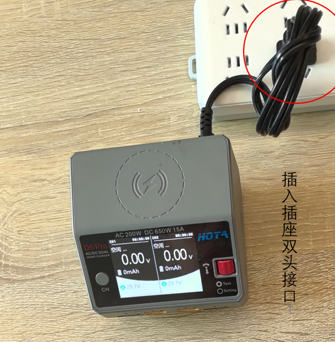
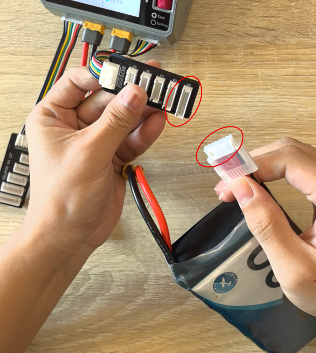
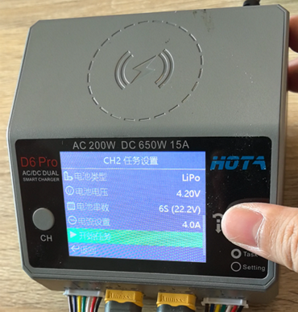
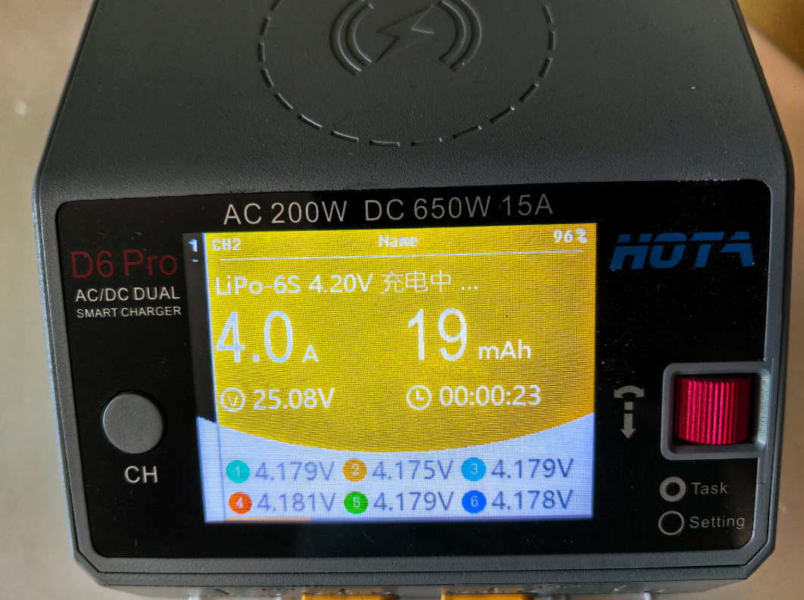

# D6 Pro充电器完整说明书

本小节主要介绍D6 Pro智能充电器的完整使用方法，根据您本次的实验时长来评估飞机锂电池电量是否能够完成实验。建议每次飞行前将电池电量充满。

## 重要安全提示

  <strong>安全警告：</strong> 
  1. 维护时，避免直接日晒，潮湿，远离高温，选择干燥，阴凉处摆放，建议使用防火袋或防爆箱保存； 
  2. 满电的锂聚合物电池内部化学反应比较活跃，满电存放太久会老化，降低放电能力，最好的存放电压为3.85左右； 
  3. 电量充满后请及时拔出充电器！不要满电后长时间充电，以防电池过充！(如果使用D6 Pro智能充电器，充满电后，会有声音提示，并自动停止充电。) 
  4. 不要在无人的情况下使用充电器，如充电器出现任何功能异常请立即终止使用并对照说明书查阅原因； 
  5. 确保充电器远离灰尘潮湿雨高温，避免阳光直射及强烈震动； 
  6. 充电器电源输入为直流6.5-30V，连接电源时务必确保电源电压与充电器工作电压范围相符。

# D6 Pro AC/DC双通道智能充电器操作说明书

## 产品概述

### D6 Pro充电器技术规格

  <table class="alt-table">
    <tr><td>净重</td><td>575g</td></tr>
    <tr><td>输入电压</td><td>AC 100-240V / DC 6.5-30V</td></tr>
    <tr><td>充电功率</td><td>AC 200W (自动分配)</td></tr>
    <tr><td>放电功率</td><td>内部放电: 15W x 2 (平衡口10Wx2) 外部放电: 325W x 2(650W)</td></tr>
    <tr><td>充电电流</td><td>0.1-15A x 2</td></tr>
    <tr><td>放电电流</td><td>0.1-3A x 2</td></tr>
    <tr><td>外部放电电流</td><td>1-15A x 2</td></tr>
    <tr><td>平衡电流</td><td>最大1600mA x 2</td></tr>
    <tr><td>显示屏尺寸</td><td>2.8" 320x240 26万色</td></tr>
    <tr><td>外形尺寸</td><td>108mm x 105mm x 76mm</td></tr>
    <tr><td>工作温度</td><td>0-40°C</td></tr>
    <tr><td>存储温度</td><td>-20-60°C</td></tr>
    <tr><td>USB输出口</td><td>5V / 2.1A</td></tr>
    <tr><td>无线充电</td><td>最大5W输出</td></tr>
    <tr><td>颜色</td><td>白色/黑色/灰色</td></tr>
  </table>

### 支持的电池类型

| 电池类型 | 支持串数 | 最大充电电流 | 满充电压 | 存储电压 | 平衡充 | 非平衡充 |
| -------- | -------- | ------------ | -------- | -------- | ------ | -------- |
| LiPo     | 1-6S     | 15.0A        | 4.20V    | 3.80V    | 支持   | 支持     |
| LiHV     | 1-6S     | 15.0A        | 4.35V    | 3.85V    | 支持   | 支持     |
| LiFe     | 1-6S     | 15.0A        | 3.65V    | 3.20V    | 支持   | 支持     |
| LiIon    | 1-6S     | 15.0A        | 4.10V    | 3.60V    | 支持   | 支持     |
| NiCd     | 1-16S    | 15.0A        | 1.50V    | 1.20V    | 不支持 | 支持     |
| NiMH     | 1-16S    | 15.0A        | 1.93V    | 1.60V    | 不支持 | 支持     |
| Pb       | 1-12S    | 15.0A        | 2.46V    | 2.00V    | 不支持 | 支持     |

## 产品功能指示

### 接口说明

*注：上图显示了D6 Pro充电器的接口布局和控制面板说明*

**控制面板：**

- **通道选择键**：选择通道1或通道2
- **飞梭键**：确认/设置参数/菜单操作
- **显示屏**：2.8英寸彩色显示屏，显示充电状态和参数

**接口面板：**

- **通道1输出口**：连接电池主电源线（通道1）
- **通道2输出口**：连接电池主电源线（通道2）
- **通道1平衡口**：连接电池平衡线（通道1）
- **通道2平衡口**：连接电池平衡线（通道2）
- **AC接口**：连接交流电源（100-240V）
- **DC接口**：连接直流电源（6.5-30V）
- **5V输出**：USB输出接口
- **无线充电**：无线充电区域
- **升级口**：固件升级接口

## 使用与设置

### 基本操作流程

1. **连接电源**：将电源与充电器AC或DC口连接，等待系统自检完成
2. **选择通道**：在待机界面下将电池连接好充电器，短按通道键可自由选择切换通道
3. **设置参数**：选择相应通道后，短按一下飞梭键即弹出任务设置菜单
4. **开始充电**：设置好参数后，按飞梭键开始执行任务

### 如何确定充电电流

在充电前必须先了解清楚所用电池允许的最大充电电流。使用过大的电流充电会对电池的寿命造成影响甚至损坏，过大的电流充电也会造成充电过程中电池发热甚至爆炸。

**充电电流计算方法：**
电池充放电能力一般以C数来标识，充电C数乘以电池容量就是电池所支持的最大充电电流。

**例如：** 1000mAh的电池标识充电能力为5C，那么最大充电电流为1000×5=5000mA，也就是最大支持5A充电。

**安全建议：** 对于锂电池而言，如果无法确定电池所支持的充电C数，为了安全起见，请将充电电流设定在不大于1C的值。

**充电时间参考：** 充电时间 = 60分钟/充电C数

- 例如：使用1C充电，充电完成时间大约需要60-70分钟

### 操作技巧

1. **通道切换**：短按通道键可自由选择切换通道
2. **任务调整**：当任务正在执行时，短按一下飞梭键即可弹出任务调整菜单，对任务电流进行调整
3. **快速结束**：长按通道选择键可快速结束当前通道任务或进入当前通道任务设置菜单

### 充电器设置

待机界面下长按一下飞梭键即弹出充电器设置菜单：

#### 任务参数设置

- **安全定时**：允许最大运行时间，运行超过该设置自动保护停止任务（默认2400分钟）
- **最大容量**：允许最大充电容量，运行超过该设置自动保护停止任务（默认999999mAh）
- **终止电流**：任务完成电流相对于任务电流比例，实际电流小于该值才判断终止（默认10%）
- **涓流充电**：是否开启涓流充电（开或关）

#### 系统参数设置

- **语言**：切换界面语言（简体中文）
- **最大输入功率**：设定充电器输入功率限制（默认700W）
- **最低输入电压**：设置充电器最低允许输入电压（默认6.5V）
- **背光亮度**：调节屏幕亮度（高/中/低）
- **无线充电**：开启或关闭无线充电功能
- **音量**：调节蜂鸣器音量（高/中/低/关）
- **完成声音**：工作完成提示音（单次/重复）
- **设备名称**：手动输入设备名称

### 任务设置

将电源与充电器AC或DC口连接，等待系统自检完成。在待机界面下将电池连接好充电器，选择相应通道后，短按一下飞梭键即弹出任务设置菜单：

**任务选择：** 可选充电/放电/外部放电/存储/平衡
**电池类型：** 可选LiPo/LiHV/LiFe/LiIon等
**电池电压：** 微调电池满充电压
**电池串数：** 选择1-6S，如果已插入平衡口此选项为自动检测，无需设定
**电流设置：**

- 充电/存储：0.1-15.0A
- 放电：0.1-3.0A
- 外部放电：1.0-15.0A

### 任务设置注意事项

#### 充电功能

D6 Pro AC/DC双通道智能充电器为串充工作方式，连接电池时必须连接电池的输出线。对于锂电池强烈建议连接平衡口进行平衡方式充电，以确保充电器能精确监控每节电芯的电压并对一致性不佳的电芯进行平衡操作。

**充电状态指示：**

- **橙色**：充电进行中
- **绿色**：充电完成（电芯压差小于20mV）
- **蓝色**：精确平衡完成（电芯压差小于10mV）

**温馨提示：** 如在户外充电希望快速完成，可以在看到绿色状态时就停止充电。当有充足时间希望电芯能达到较好的平衡度，那就等待蓝色提示的出现，或者在蓝色提示后再延长等待一段时间，平衡效果更精确。

#### 放电功能

放电功能可对电池进行放电，推荐连接平衡口进行放电，速度更快且放电终止检测更为精确。由于内部放电功率限制，放电可能会比较慢，这属于正常现象。

## 6S 8000mAh动力电池充电指南

此电池为Swing VTOL无人机飞机动力电池，使用D6 Pro充电器进行充电的详细步骤：

### 第一步：连接准备

1. **连接电源**：将AC电源线连接到D6 Pro充电器的AC输入接口（100-240V交流）
2. **等待自检**：充电器自动开机并进行系统自检，等待完成
   
   
   

### 第二步：连接电池

1. **主电源线连接**：将6S电池的主电源线连接到充电器的主输出口（通道1或通道2）
2. **平衡线连接**：将电池的平衡线连接到充电器的平衡接口
3. **确认连接**：确保所有连接牢固，无松动
   
   

### 第三步：设置充电参数

1. **选择通道**：短按通道键选择已连接电池的通道
2. **进入设置**：短按飞梭键弹出任务设置菜单
3. **设置参数**：
   - 任务选择：充电
   - 电池类型：LiPo/LiHV（根据电池类型选择）
   - 电池串数：6S（自动检测）
   - 充电电流：建议8A（1C充电，8000mAh × 1C = 8A）
     
     

### 第四步：开始充电

1. **参数确认**：通过2.8英寸彩色显示屏确认所有参数正确
2. **启动充电**：按飞梭键开始执行充电任务
3. **监控过程**：通过显示屏实时监控充电状态

   

### 第五步：等待充电结束

  1.**充电中**

  2.**充电完成**
    * 充电完成后会一直有“哔哔”的提示音，需点击飞梭键完成充电。

### 充电监控要点

- **电压显示**：实时显示总电压和各单体电压
- **电流显示**：显示当前充电电流
- **时间显示**：显示已充电时间
- **状态颜色**：橙色（充电中）→ 绿色（基本完成）→ 蓝色（精确平衡）

### 充电完成处理

- **自动停止**：充电完成后自动停止并发出提示音
- **安全断开**：先按飞梭键停止当前任务，待显示待机画面后再移除电池
- **存储准备**：如不立即使用，建议使用存储模式将电池调至3.85V/单体

## 高级功能说明

### 外部放电功能

外部放电功能利用外部高功率负载电阻快速对电池进行精确放电。使用时待放电电池需连接在输入口，同时输出连接电阻负载。推荐负载电阻的阻值为1.5-2.5欧之间，其它阻值可以正常使用但可能无法满功率运行。外部放电运行时负载发热非常大，请注意安全，避免发生意外事故或导致人身伤害。

### 存储功能

选择存储功能时，电池如果低于预设存储电压将自动进行充电任务，电池电压如高于预设存储电压将自动进行放电任务。存储及放电任务为了节约任务时间不会对电芯电压进行精确平衡，任务结束时电芯电压与预设值有可能存在一定误差，这属于正常现象。

### 平衡功能

平衡功能用于平衡各电压电池使之相等。平衡时间长短与电池电压压差、目标电压有关。菜单切换到平衡模式时，充电器自动分析并设置了初始平衡电压值，用户也可以自由调整。充电器的充电能力远大于放电能力，平衡操作时选择大于等于当前电池电压通常可以获取更快的平衡速度。

### 内阻测量功能

D6 Pro AC/DC双通道智能充电器具有电芯内阻测量功能，此功能仅在对电池进行平衡方式充电任务时有效。在充电任务开始后大约两三分钟开始测量并计算出电芯内阻。电池内阻在不同电量时会存在差异，一般来说电量较多时测得的内阻值会较低。

### 电池激活与修复

充电任务开始后，如果检测到电芯电压低于预充电压，将会使用十分之一任务设定电流对电池进行激活修复，待电压高于预充电压后才会调整到设定电压进行充电。这样的流程设计可以保护过放的电池并对其进行激活修复。

## 故障排除

### 常见问题及解决方法

| 问题           | 可能原因     | 解决方法                                   |
| -------------- | ------------ | ------------------------------------------ |
| 充电器无法开机 | 电源连接问题 | 检查AC/DC电源连接，确认电压范围6.5-30V     |
| 充电电流异常   | 电池连接不良 | 检查主电源线和平衡线连接                   |
| 显示异常       | 系统故障     | 重启充电器或恢复出厂设置                   |
| 充电停止       | 电池保护触发 | 检查电池电压和温度，确认参数设置正确       |
| 平衡效果差     | 平衡线未连接 | 确保平衡线正确连接                         |
| 充电时间过长   | 充电电流过小 | 适当增加充电电流，但不超过电池最大充电电流 |

## 工作状态显示详解

### 分屏显示状态

充电器支持双通道分屏显示，可以同时监控两个通道的工作状态。分屏显示状态简易操作：

1. 开机默认进入分屏显示空闲状态
2. 空闲状态下可长按飞梭键进入充电器设置
3. 短按CH键可切换通道显示
4. 长按CH键可停止双通道当前任务

### 空闲状态显示

空闲状态简易操作：

1. 将电源与充电器AC或DC口连接，等待系统自检完成，在待机界面下将电池连接好充电器
2. 空闲状态下以黑色显示，此时输出电流、电池总电压、已完成容量、运行时间均为零
3. 旋转飞梭键可切换屏幕下半部的信息显示内容（各电芯电压、运行数据）
4. 选择相应通道后短按飞梭键可调出任务设置菜单
5. 短按CH键可切换通道显示
6. 长按飞梭键可进入充电器设置菜单

### 放电状态显示

放电中状态简易操作：

1. 将电源与充电器AC或DC口连接，等待系统自检完成，在待机界面下将电池连接好充电器
2. 选择相应通道后短按飞梭键即弹出任务设置菜单，将任务设置为放电，调整任务参数，短按飞梭键开始任务
3. 旋转飞梭键可以切换屏幕下半部的信息显示内容（各电芯电压、运行数据），其中电芯电压仅在平衡模式下才显示
4. 当放电任务正在执行时，可短按飞梭键调出任务调整菜单，对放电电流进行调整，长按CH键可停止当前任务

### 外部放电状态显示

外部放电中状态简易操作：

1. 将放电的电池与充电器输入端(DC口)连接，等待系统自检完成，在待机界面下将高功率负载电阻与充电器输出端连接
2. 选择相应通道后短按飞梭键即弹出任务设置菜单，将任务设置为外部放电，调整任务参数，短按飞梭键开始任务
3. 当外部放电任务正在执行时，可短按飞梭键调出任务调整菜单，对外部放电电流进行调整，长按CH键可停止当前任务

### 存储状态显示

存储充电中状态简易操作：

1. 将电源与充电器AC或DC口连接，等待系统自检完成，在待机界面下将电池连接好充电器
2. 选择相应通道后短按飞梭键即弹出任务设置菜单，将任务设置为存储，调整任务参数，短按飞梭键开始任务
3. 旋转飞梭键可以切换屏幕下半部的信息显示内容（各电芯电压、运行数据），其中电芯电压仅在平衡模式下才显示
4. 当存储任务正在执行时，可短按飞梭键调出任务调整菜单，对存储电流进行调整，长按CH键可停止当前任务

### 平衡状态显示

平衡中状态简易操作：

1. 将电源与充电器AC或DC口连接，等待系统自检完成，在待机界面下将电池连接好充电器
2. 选择相应通道后短按飞梭键即弹出任务设置菜单，将任务设置为平衡，调整任务参数，短按飞梭键开始任务
3. 旋转飞梭键可以切换屏幕下半部的信息显示内容（各电芯电压、运行数据）
4. 当平衡任务正在执行时，可短按飞梭键调出任务调整菜单，对平衡电流进行调整，长按CH键可停止当前任务

## 充电器维护保养

### 日常维护

1. **定期清洁**：定期清洁充电器表面，保持通风口畅通
2. **环境要求**：避免在潮湿环境中使用和存放，避免高温和阳光直射
3. **连接检查**：定期检查连接线是否有磨损或损坏
4. **定期通电**：长时间不使用时，建议每月通电一次

### 安全存放

- 将充电器放置在干燥、阴凉处
- 远离易燃物品和高温环境
- 避免强烈震动和冲击

## 产品合格性声明

D6 Pro AC/DC双通道智能充电器符合相关的FCC第15章B:2017相关指令，并通过以下标准认证：

- EN 60950-1:2006+A11:2009+A1:2010+A12:2011+A2:2013
- ETSI EN 301 489-1 V2.2.0(2017-03)
- ETSI EN 301 489-3 V2.1.1(2017-03)
- EN 62311:2008
- ETSI EN 303 417 V1.1.1(2017-09)

## 保修及服务

**保修条款：**
自您购买产品之日起，我公司提供一年的保修，一年内我公司将免费为您维修产品。如由于客户使用不当或者自行改装引起的任何损害，我公司将不提供免费维修服务。

**保修范围：**
在保修期间若有下列情形恕不免费修理：

1. 未按用户手册规定使用或擅自拆修、添附或修改造成的故障或损坏
2. 由于天灾、跌打、碰撞、不当电压所造成的故障或损坏
3. 超过规定期限，如需配换零件需酌情收取元件费和维修费

**技术支持：**

- 官网：www.hota-exp.com
- 版本：Ver 1.1.8

---

**注意：** 本说明书基于D6 Pro充电器官方文档整理，如有疑问请参考原厂说明书或联系技术支持。
