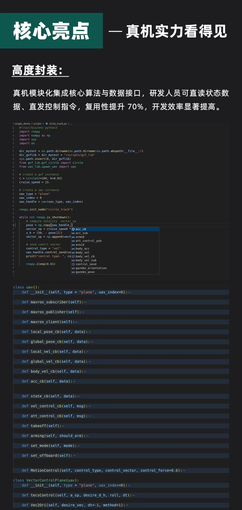
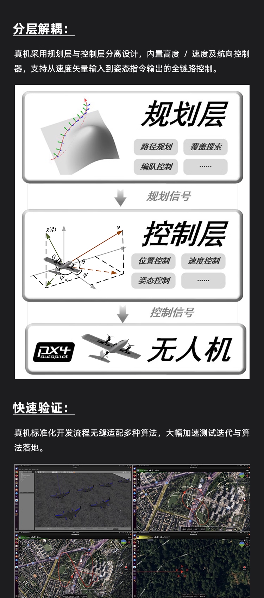
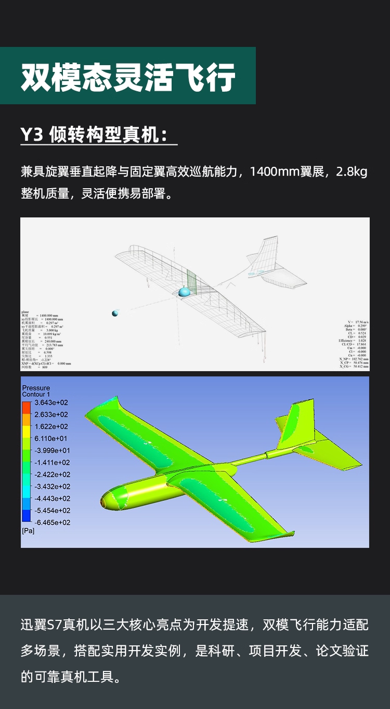
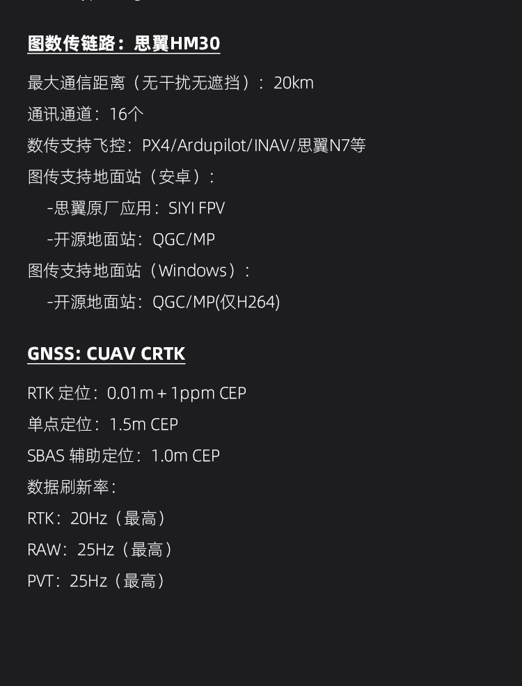

# SwiftWingVtolS7

* SwiftWingVtolS7
  自2023年起，迅翼SwiftWing深耕固定翼无人机领域，均由985硕博团队搭建系统化快速入门知识体系，覆盖气动建模、底层控制及上层规划等核心模块，助力开发者打通全流程开发链路、降低技术入门门槛。依托前期知识沉淀，迅翼SwiftWing于2024年推出固定翼无人机算法开发平台，为开发人员提供高效研发载体，支持固定翼上层飞行控制、路径跟踪、集群编队等算法的科研仿真验证。2025年，迅翼SwiftWing进一步升级技术支撑能力，正式发布S7VTOL垂起固定翼无人机科研验证平台，将科研仿真验证，扩展到真机飞行验证，实现底层飞行控制与上层规划控制算法的全流程开发、调试与验证，持续推动无人机技术创新与应用落地。

## SwiftWingVtolS7上层组件

