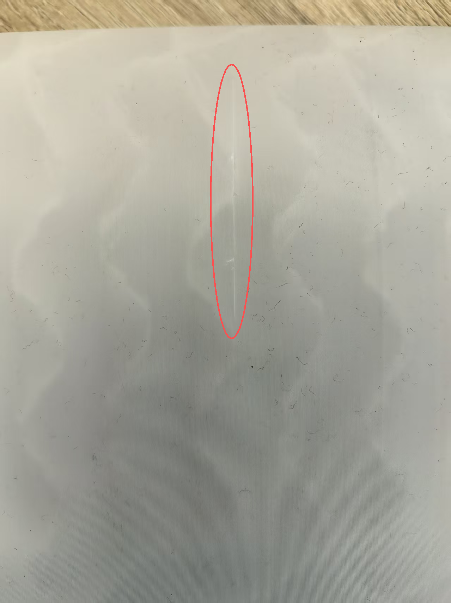

# 产品维护保养
## 3D打印无人机使用说明
请勿过度按压3D打印零部件，避免打印件承受过大应力。拾放无人机时，建议握持碳管等承力部件，以保护3D打印连接件不受额外压力。
## 3D打印件使用说明

#### 温度控制

3D打印件对温度较为敏感，应避免长时间暴露在高温环境中。夏季高温天气下，飞行器在阳光直射下表面温度可能超过60℃，这已接近部分打印材料的软化温度点。建议在高温环境下飞行时，尽量选择早晚温度较低的时段，或在飞行间隙将飞行器移至阴凉处降温。如果需要在高温环境中长时间作业，可考虑使用耐温性能更好的材料（如ABS或尼龙）制作的部件，或增加散热设计。

#### 避免剧烈冲击

尽管3D打印件通过优化打印方向、填充密度和层间结合力可以获得较好的机械强度，但其整体韧性仍不及传统注塑件。在飞行和搬运过程中，应尽量避免剧烈碰撞和坠落。起飞和降落时应选择平整、松软的地面，避免硬着陆造成的冲击损伤。携带运输时，建议使用专用包装箱或泡棉缓冲材料，将飞行器固定牢固，防止在运输过程中晃动碰撞。

#### 定期检查维护

3D打印件在使用过程中会逐渐出现材料老化现象，表现为韧性下降、颜色变淡、尺寸微变等。建议每次飞行前进行外观检查，重点关注以下部位：机翼连接处、电机座、起落架、舱门卡扣等受力或频繁拆卸的部位。检查时注意观察是否有裂纹、分层、变形、螺丝松动等情况。如发现轻微裂纹，可使用502快干胶或环氧树脂进行修补；如裂纹扩展或部件变形严重，及时更换新件。

#### 紫外线防护

长期暴露在阳光下，紫外线会导致3D打印件表面老化、颜色褪变、材料变脆。这是因为紫外线能量会破坏聚合物分子链，造成材料降解。对于户外使用的飞行器，建议采取以下防护措施：尽量避免在强紫外线下长时间暴晒，必要时使用遮阳棚或阴凉处停放；定期使用塑料保护剂对表面进行涂抹，形成保护膜。

#### 螺丝紧固件维护

3D打印件上的螺丝孔是相对薄弱的环节，频繁拆装可能导致螺纹磨损或滑牙。建议在首次装配时使用合适的螺丝扭矩，避免过度拧紧造成基材开裂；对于经常拆卸的部位，可在螺丝上涂抹少量螺纹锁固胶（如乐泰243）；如发现螺丝松动及时紧固，螺纹损坏后应使用丝攻修复或更换部件。另外，不同金属材料的螺丝与打印件接触可能产生电化学腐蚀，建议使用不锈钢或尼龙螺丝，并在接触面加装绝缘垫片。

### 常见问题处理

#### 轻微裂纹修补

当发现机身部件出现细小裂纹时，可采用以下方法进行修补：首先用砂纸轻轻打磨裂纹周围，去除表面油污和杂质；然后将502快干胶滴入裂纹中，待其渗透填满裂缝后，静置固化24小时以上；如裂纹较深或较长，可分多次填补，每次填补后等待完全固化；最后用砂纸打磨修补区域，使其表面平整，必要时可喷涂同色漆料进行遮盖。对于重要受力部件，建议使用双组分环氧树脂进行修补，其粘接强度和耐久性优于502胶水。

#### 部件更换建议

当3D打印件出现以下情况时，建议进行更换而非修补：部件主体结构出现贯穿性裂纹或断裂；受力关节部位严重变形，影响功能装配；连接孔位严重磨损，无法保证安装精度；经过多次修补后裂纹仍持续扩展。在更换部件时，建议使用与原厂相同或性能更优的材料打印新件，并严格按照装配指南进行安装调试。

### 存储与保养

#### 存放环境要求

3D打印件应存放在阴凉、干燥、避光的环境中，最佳存储温度为15-25℃，相对湿度不超过60%。避免将飞行器放置在车内、阳台等温差较大或阳光直射的位置。长期存放时，建议将飞行器拆卸后分别存放，各部件之间用软质材料隔开，避免相互挤压造成变形。存放地点应远离热源（如暖气片、发动机等）和化学品（如溶剂、油漆等），防止材料受到化学侵蚀。

#### 清洁方法

定期清洁飞行器可保持外观整洁并及时发现问题。清洁时应使用柔软的毛刷或湿布轻轻擦拭，避免使用高压水枪或尖锐工具。对于难以清除的污渍，可使用少量中性清洁剂溶液擦拭，然后用清水擦净，最后用软布擦干水分。清洁过程中注意检查各部件连接处是否有松动、裂纹或异物堆积。电机、散热孔等部位应重点清理，防止灰尘堆积影响散热或运动部件的灵活性。

## 安全飞行指引

### 飞行条件要求

#### 操作要求

在产品使用前，请认真阅读《免责声明和安全概要》、《用户手册》、《保养手册》的内容。

#### 飞行限制

1. 在飞行前咨询当地有关部门，以确保符合当地的法律法规要求。
2. 在限飞区飞行前，请您提前申请解禁服务。

## 检查保养

* 在作业前开展例行检查、定期保养，可大幅提升产品可靠性能，降低安全隐患。

### 飞行前检查列表

1. 确保遥控器、飞行器电池电量充足，且智能飞行电池安装稳固
2. 确保飞行器内部无异物（如：水、油、沙、土等），飞行通风口、相机散热孔及电机通风无遮挡。
3. 确保飞行器螺旋桨型号一致且安装牢固；电机和桨叶干净无异物、无破损变形。
4. 确保遥控器天线已展开。
5. 确保飞行场所处于适飞空域内且适合飞行；将飞行器放置于户外平整开阔地带，周边无障碍物、建筑物、树木等，飞手距离飞行器 5 米并面朝机尾。
6. 若多架飞行器同时作业，请划分空域飞行，避免空中相撞。

### 机身保养维护

* 机身等零部件为3D打印件，较为脆弱，出现以下类似裂纹，如进行评估鉴定不影响飞行，可使用502或416胶水自行修补
* 如零部件出现严重损坏，无法进行修补，建议联系我们进行维修

### 动力电池

#### 电池保养

1. 锂电池长期不用应充入50%~80%的电量
2. 需在干燥阴凉的环境中存放
3. 建议每隔3个月充一次电池

#### 标准充放电操作指导

1. 避免在高温烈日下暴晒，并进行充电。
2. 严格禁止在高温环境下充电。
3. 避免高温下飞行后立即充电。
4. 防止充电时间过长，充电到充电器转绿灯后即为充满，不得长时间充电。
5. 如果电池发出异味、发热、变形、变色或出现其它任何异常现象时不得使用;如果电池正在使用或充电，应立即从电器中或充电器上取出并停止使用。
6. 不要使用在极热环境中的电池，比如阳光直射或热天的车内。

#### 报废电池的处理方式

1. 使用绝缘水桶装满 5% 浓度的盐水，将电池完全浸入其中 72 小时以上，至完全放电。
2. 完成步骤 1 后，联系专业电池回收公司进行回收处理，避免污染环境。

#### 注意事项

1. 充电过程中必须远离易燃易爆物品。
2. 避免在潮湿环境下使用电池，防止电池出现短路情况。
3. 禁止以任何方式拆解或穿刺电池。
4. 建议在阴凉干燥的地方存储电池。