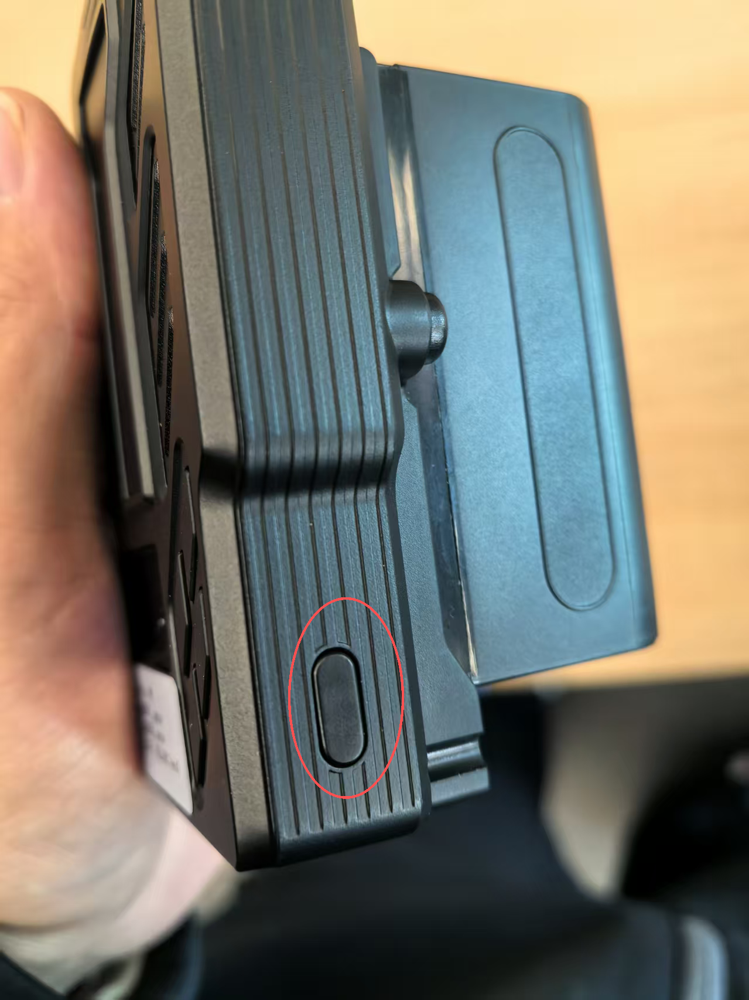
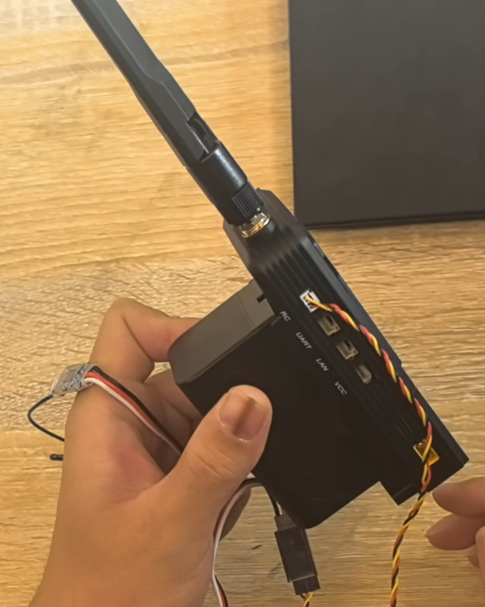
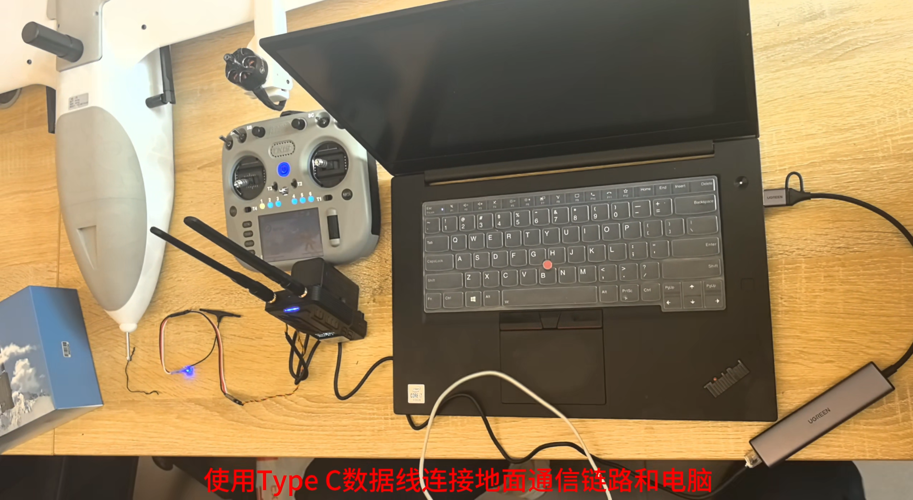

# 2准备通信链路

* 硬件准备为每次飞行都需要进行
* 软件准备为第一次，按照教程配置软件连接。后续飞行，按需调整对应配置即可

## 硬件准备

1. SIYI通信链路地面端
2. 遥控器、接收机
3. VtolS7无人机主体
4. 无人机电池
5. 电脑

### 给SIYI通信链路地面端、遥控器上电

1. 将HM30本体对准电池卡槽，向下按压电池，确保安装没有虚位


* 如需完成电池拆卸，需按住黑色按钮，上抬电池即可完成拆卸


* 开机： 关机状态下，短按电源键，OLED显示屏将提示“Press again to power
  on”，接着立即长按电源键约两秒，地面端将开机。



### 硬件连接到SIYI通信链路地面端

*连接线带有锁扣设计，使连接线不易脱落，需注意按压锁扣进行插拔*


1. 将接收机连接到思翼通信链路地面端RC端口(注意端口插头方向请勿硬拔硬插)



2. 使用思翼HM30通信链路地面端配套网口线连接电脑网口与地面端LAN端口(注意端口插头方向请勿硬拔硬插)


3. 使用type-C线连接电脑与地面端对应端口




* 将VtolS7无人机放置到空旷的起飞点，然后上电，关闭电池仓


## 软件准备

### 无线连接飞控

* 部分电脑USB在连接上SIYI通信链路地面端，打开QGC后，会自动连接上。
* 如果没有自动连接，则按照下面教程手动连接
* 打开电脑设备管理器，找到新增的端口


* 打开QGC软件，新增一个端口连接，配置如下，然后点击确认


1. 选中刚才新建的连接配置
2. 点击连接，然后返回主页即可


* QGC主页有数据显示则说明连接成功


### Nomachine 无线连接机载电脑

 电脑网口连接SIYI通信链路地面端

* 若未连接到网络，操作如下：


* 在终端测试，收到机载的回复，说明可以ssh、nomachine等远程访问机载了


* 打开Nomachine远程软件，添加下面的连接设置，再点击Add保存


* 双击，开始连接


* 输入账号、密码，点击OK


* 出现下图，则说明远程访问机载成功


### VSCode SSH 连接机载电脑(推荐)

- 打开VS Code，安装Remote - SSH插件
  
- VS Code打开左下角绿色按钮，选择“连接到主机”
  
- 选择“配置SSH主机”
  
- 选择默认的SSH配置文件即可，将以下文字复制到.config文件中。

```
Host swing
    port 22
    HostName 192.168.144.60
    User swing
```

- 再次点击VS Code左下角绿色按钮，选择“连接到主机”，随后选择swing进行连接。
  
- SSH远程连接成功后，可在VS Code中新建终端，进行机载计算机的远程终端操作。
