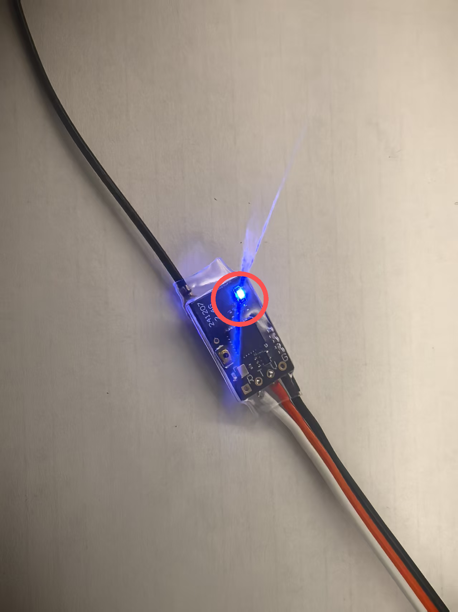
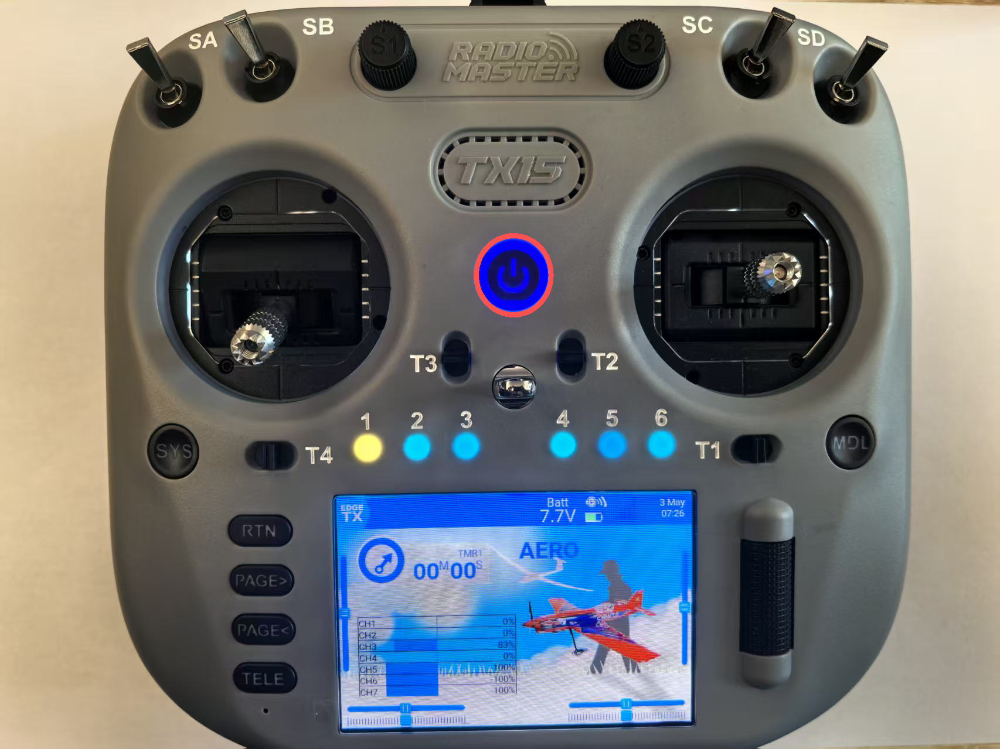
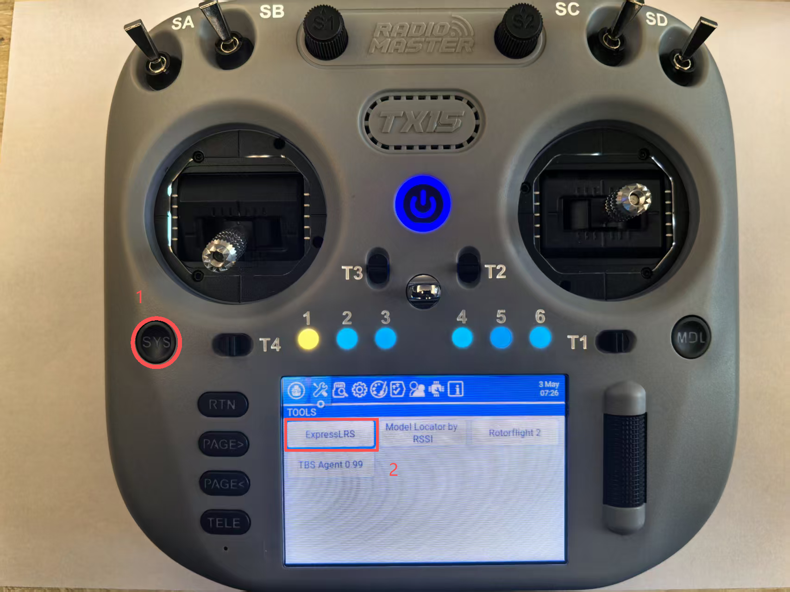
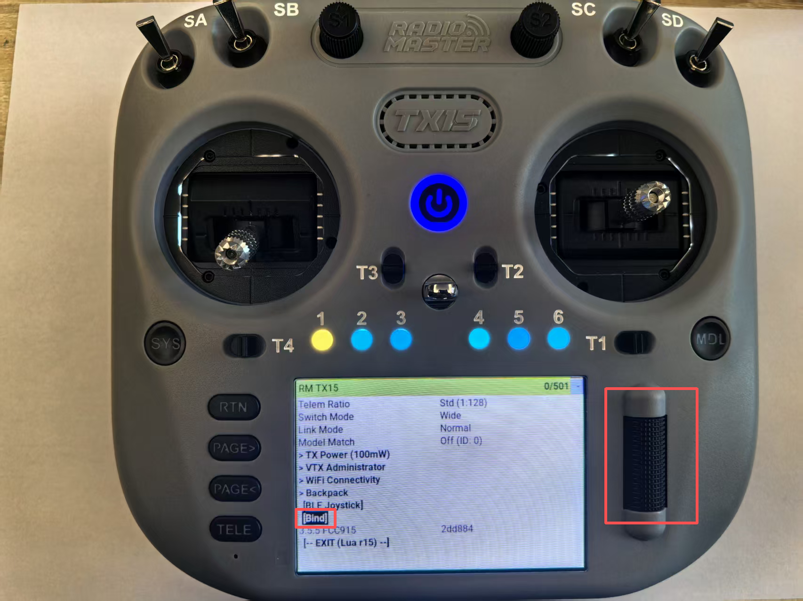
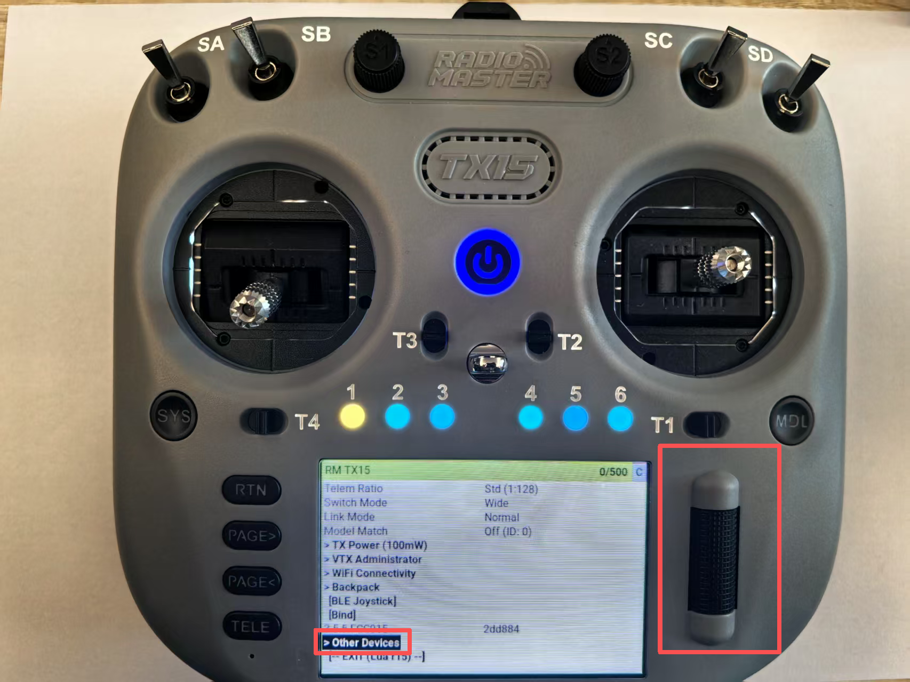
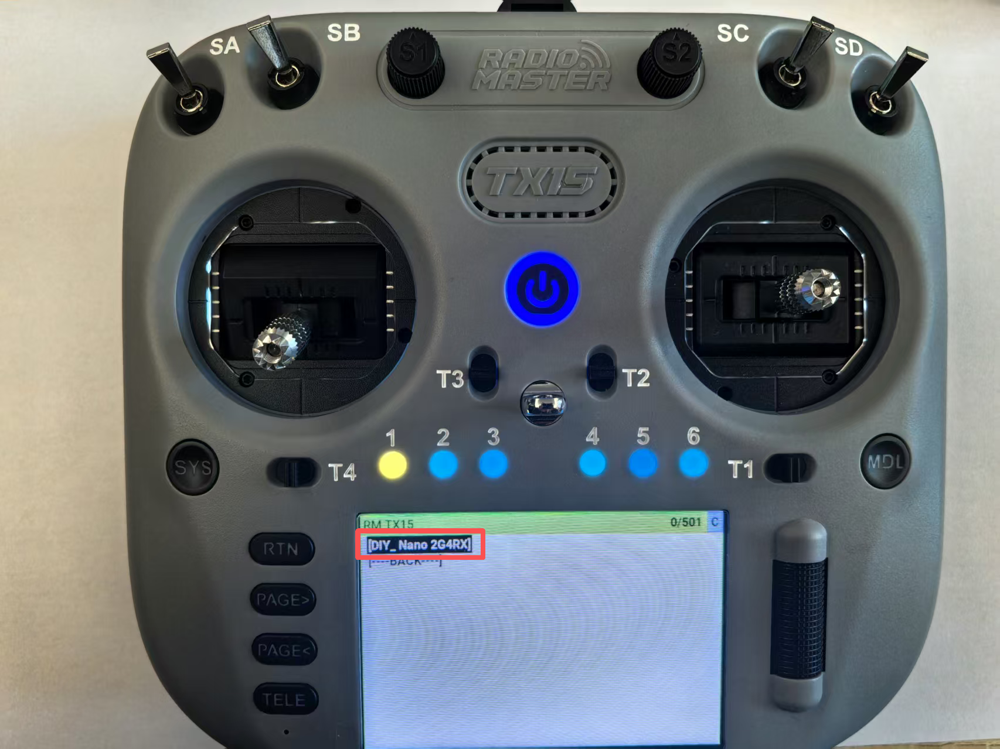
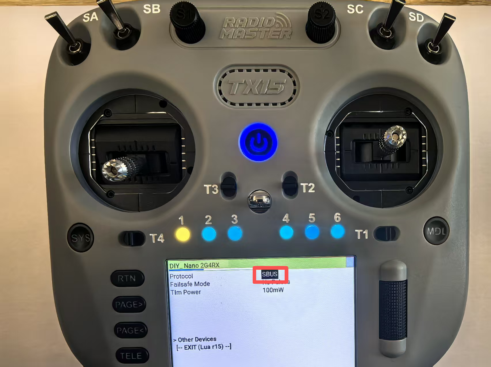

# 准备遥控器

## 遥控器功能


## 拨杆功能设置

遥控器默认为美国手，控制逻辑如下：

*  美国手遥控器控制逻辑示意图
```
┌─────────────────────────────────────────────────┐
│                     遥控器                      │
├─────────────┬───────────────────────────────────┤
│   左摇杆    │               右摇杆              │
├─────────────┼───────────────────────────────────┤
│  ↑ 油门增加 │  ↑       俯仰（机头向下）         │
│  ↓ 油门减少 │  ↓       俯仰（机头向上）         │
│  ← 偏航左转 │  ←          滚转（向左）          │
│  → 偏航右转 │  →          滚转（向右）          │
└─────────────┴───────────────────────────────────┘
```


## 按键功能表

| 按键名称/位置 | 上位 | 中位 | 下位 |
|---------|---------|---------|---------|
| SE | 上锁 | 未启用 | 解锁 |
| SA| 自稳 | 定点 | 板外 |
| SD | 旋翼模式 | 未启用 | 固定翼模式 |


## 遥控器对频

* 将接收机快速将电池通断电3次，接收机指示灯快速双闪，表示进入对频待机模式。 



* 长按电源键开机



* 点击左侧”SYS“键，进入系统菜单，点击屏幕"ExpressLRS"进入遥控器高频头界面



* 滚动滚轮下滑找到“Bind”，点击滚轮键，进入遥控器对频模式



## 更改接收机输出协议

* 接收机对频上遥控器后，进入遥控器高频头界面，滚动滚轮下滑找到“Other Devices”，点击滚轮键，进入其他设备



* 找到接收机，进入接收机界面



* 滚动滚轮下滑找到“Protocol”，点击滚轮键，进行接收机输出协议选择，选择SBUS

