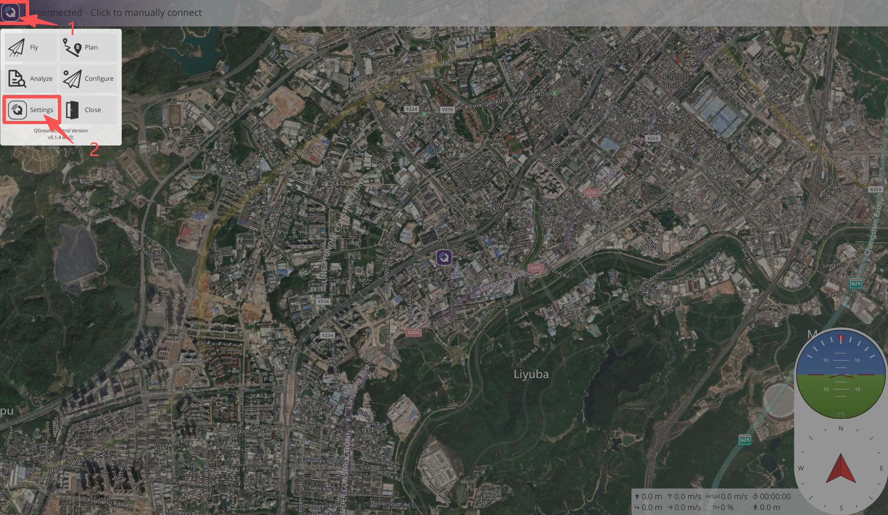
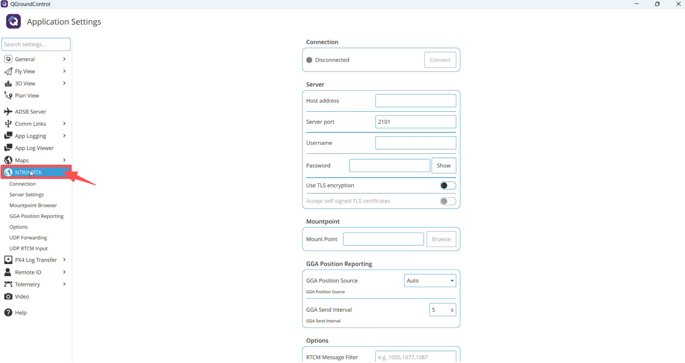
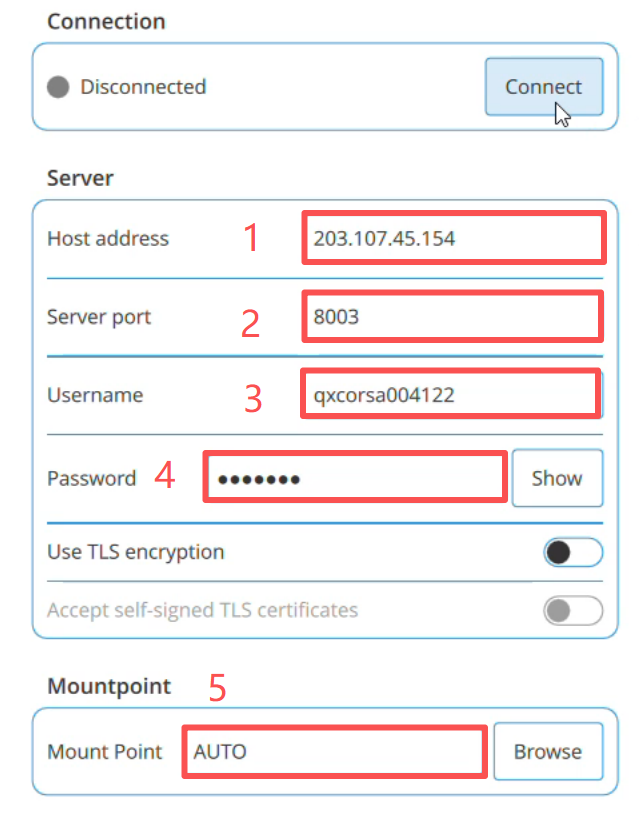
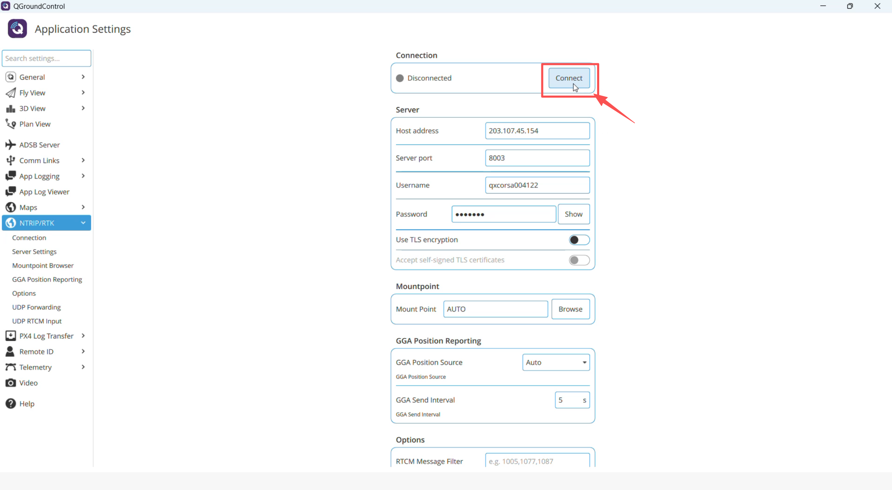
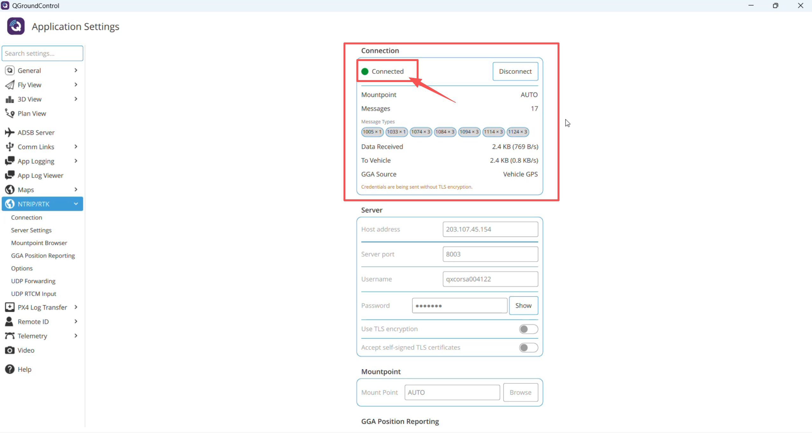
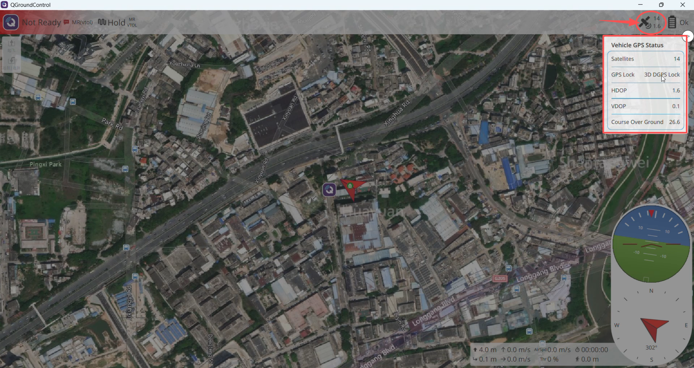
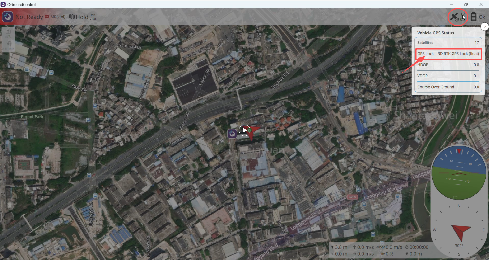
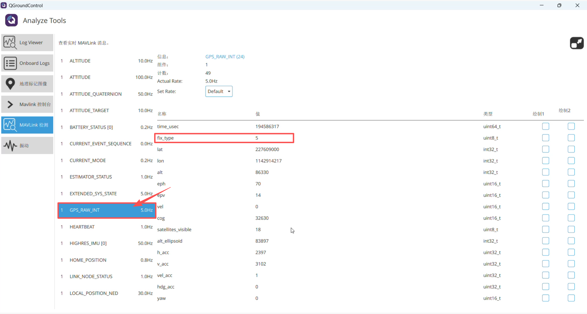

# 网络RTK的使用

网络RTK通过互联网从CORS服务商获取差分数据，地面站接收后经数传链路转发给飞控，从而实现高精度（厘米级）定位。

数据流向：**飞机 ←数传链路→ 地面站（QGC） ←互联网→ CORS服务器**。

## 准备工作

* 已在CORS服务商处（如千寻位置）购买账号，并获取以下信息：
  * 服务器地址（Host address）
  * 端口（Server port）
  * 用户名（Username）
  * 密码（Password）
* 运行地面站的电脑（或带地面站功能的遥控器）需同时具备两条链路：
  * **互联网**：用于连接CORS服务器；
  * **数传链路**：用于连接飞机、转发差分数据。
* 飞机已与地面站连接，地面站能正常收到飞机上报的GPS位置（连接后页面中"GGA Source"应显示为"Vehicle GPS"）。

## QGC地面站使用

1. 点击QGC图标，打开设置选项

2. 选择"NTRIP/RTK"选项

3. 将事先注册的信息填入对应位置

对应图中标号，各字段含义如下：

1. **Host address**：CORS服务器地址（如 `203.107.45.154`）
2. **Server port**：服务器端口（如 `8003`）
3. **Username**：账号用户名
4. **Password**：账号密码
5. **Mount Point**：挂载点，即基准站数据源。填 `AUTO` 表示由服务器自动匹配距离最近的基准站；也可点击"Browse"查看并手动选择挂载点。

> "Use TLS encryption"开关按服务商要求设置，本示例中为关闭状态。

4. 点击"Connect"连接

5. 显示"Connected"表示已经完成连接

除状态显示"Connected"外，还应确认页面中"Data Received"与"To Vehicle"两组数据流量持续增长，表示差分数据已正常接收并转发给飞机。若只显示"Connected"而流量始终为0，定位状态不会变化。

6. 查看定位状态

点击主界面右上角的GPS图标，在弹出的"Vehicle GPS Status"中查看"GPS Lock"状态。连接RTK后，状态通常会按以下过程逐步收敛：

* 刚收到差分数据时，显示"3D DGPS Lock"：

* 进入RTK解算后，显示"3D RTK GPS Lock (float)"，即浮点解（分米级），此时仍在收敛中：

* 最终收敛为"3D RTK GPS Lock"（无float字样），即固定解，达到厘米级，可以作业。

各状态对应关系如下：

| GPS Lock显示 | fix_type | 含义 |
| --- | --- | --- |
| 3D Lock | 3 | 普通3D卫星定位 |
| 3D DGPS Lock | 4 | 已收到差分数据，尚未进入RTK解算 |
| 3D RTK GPS Lock (float) | 5 | RTK浮点解，分米级，收敛过程中 |
| 3D RTK GPS Lock | 6 | RTK固定解，厘米级，可正常作业 |

7. 通过MAVLink消息确认fix_type

在"Analyze Tools → MAVLink检测"中选择"GPS_RAW_INT"消息，查看其中的"fix_type"字段。

* "fix_type"为5，说明已进入RTK浮点解；在开阔环境下继续等待，收敛到6（固定解）时定位精度最高。

## 常见问题

* **点击Connect后无法连接**：检查互联网是否正常；确认服务器地址、端口、用户名、密码是否正确；确认账号未在其他设备上登录被挤下线。
* **显示Connected但定位状态长时间不变**：检查"Data Received"/"To Vehicle"流量是否增长；确认数传链路正常、飞机已向地面站上报GPS位置。
* **长时间停留在float，无法收敛到固定解**：将飞机移到视野开阔、无遮挡的场地；确认所选Mount Point覆盖作业地区；查看卫星数量是否充足。收敛通常需要几十秒到数分钟，状态也可能反复波动，属正常现象。

## MissionPlanner地面站使用

> MissionPlanner的NTRIP配置步骤待补充。
