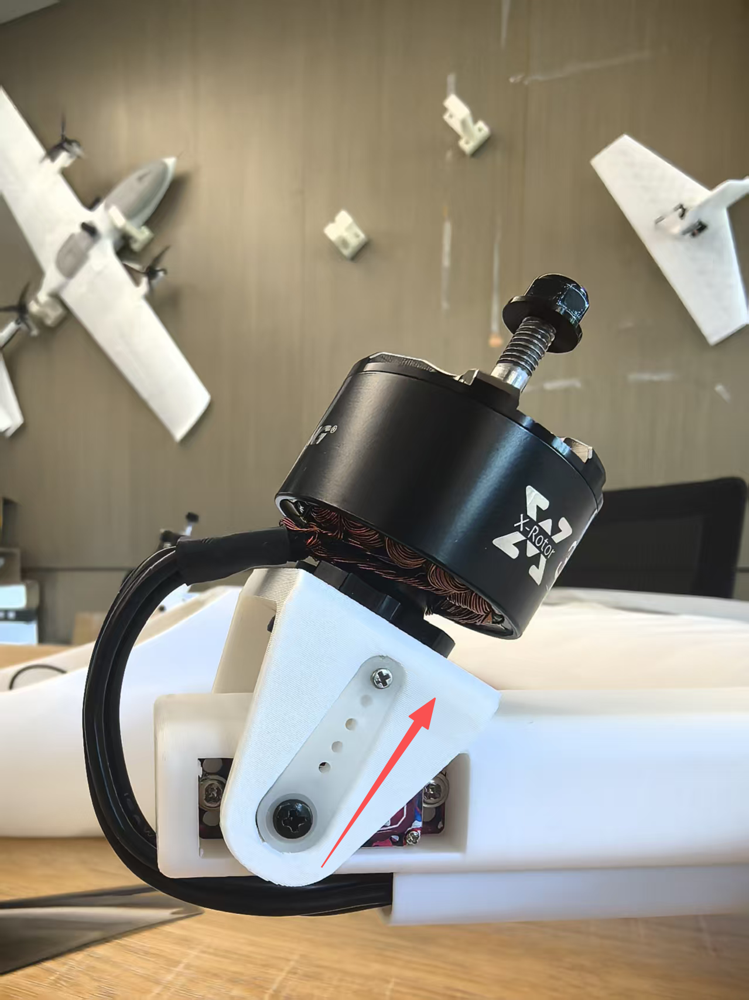
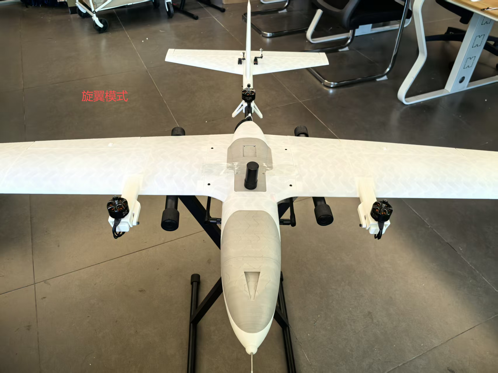
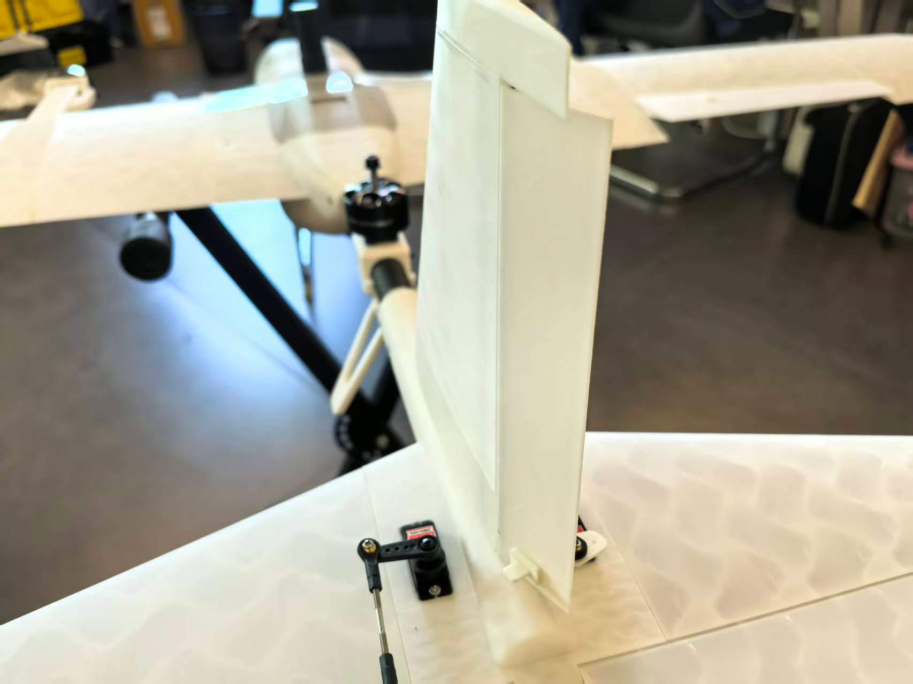
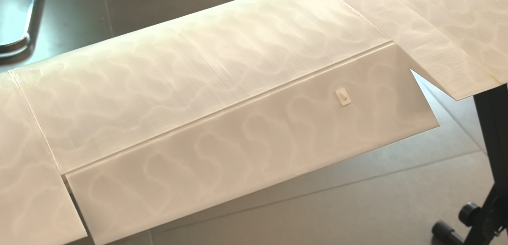
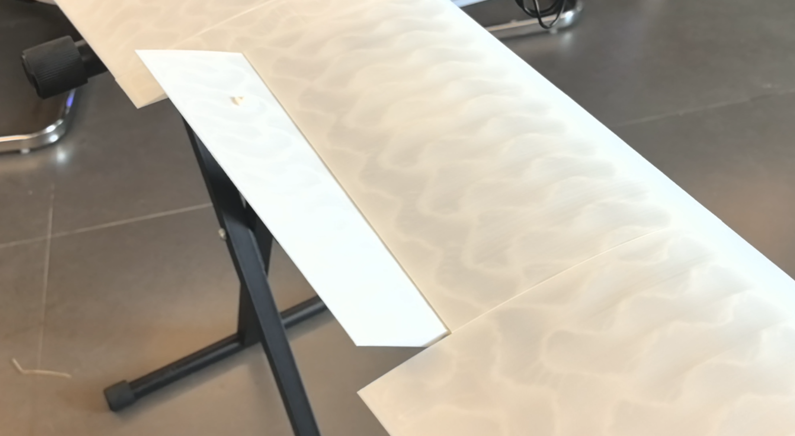

# **起飞前舵面偏转测试说明**

- 起飞前需确认固定翼模式下舵面的偏转方向正确，避免出现控制出错。一般情况下，飞机整机安装完成后，且未拆装机体、未更改遥控器配置或飞控的 actuator 参数，无需重复测试。**但如果发生以下任一情况，必须重新进行地面测试**：
  - 飞控重新接线；
  - 修改遥控器相关配置；
  - 调整飞控中 actuator 相关参数。

## **电机位置和坐标系说明**

* PX4电机坐标系说明如下
  * X轴正方向：指向无人机前方
  * Y轴正方向：指向无人机右侧

* 下图为Vtol S7的电机位置和坐标配置
  * 俯视图看Y3电机位置
  * 1号电机在左副翼，在飞控中心的(0.11,-0.25)位置，并且是顺时针旋转
  * 2号电机在右副翼，在飞控中心的(0.11,0.25)位置，并且是逆时针旋转
  * 3号电机在尾碳管，在飞控中心的(-0.34,0.0)位置，并且是逆时针旋转

## **详细检查步骤：**

- **卸下螺旋桨（断电状态下操作）**

  * 首先，在确保无人机断电的前提下，使用M8套筒或老虎钳卸下电机螺丝，依次拆除三个螺旋桨。

- **上电并检查倾转电机复位**

  1. 将无人机固定放置于测试架上，并接通电源。上电后，双倾转电机应自动复位至垂直位置。
  2. 过程中倾转舵机若有电流声属正常现象（舵机存在微小受力时，即会发出此声音），所用倾转舵机为高扭矩1 0kg级别。

- **检查电机转向（自稳模式）**
  
  1. 使用遥控器将飞行模式切换至“自稳模式（Stabilize）”，解开油门锁并后，按下解锁按钮。
  2. 缓慢推动油门，电机轻声转动即可，主要检查各电机的转向是否正确：

    * 从俯视角看，左前电机应顺时针旋转；
    * 右前电机与尾部电机应逆时针旋转。
    
  

- **倾转电机摆动方向检测（旋翼模式）**
  * 在“自稳模式”下，左右推动偏航杆，观察左右倾转电机是否按照控制方向同步摆动，确保其动作方向正确。  

- **固定翼模式切换检测**
  * 在旋翼模式下，缓慢推油门约1秒，然后拨动飞行模式转换开关，切换至“固定翼模式”。此时，两个倾转电机将缓慢过渡至约40°倾角位置，随后快速切换至水平。

  - 若电机无法顺利从40°倾角位置快速切换至水平，请对空速管进行人工吹气，模拟空速输入，协助完成切换。
  
- **舵面动作检测（固定翼模式）**
  * 切换至固定翼模式后，将油门收至0位。维持“自稳模式”，操作遥控器检查各舵面动作：
    * 模拟飞机飞行姿态，观察自稳模式下舵面是否有让飞机姿态能够回中的趋势
    * 若飞机姿态为向右滚转（如图所示），飞控修正姿态有向左回中的趋势，反应到舵面应为左副翼上，右副翼下。

* 同理，机头上翘，舵面应为向下。

  - 左右打副翼杆，检查副翼是否正确偏转；

  
  * 上下打俯仰杆，检查升降舵动作是否正确；

    
  * 左右打偏航杆，检查方向舵是否响应正常。

    
## **机载offboard检测（固定翼模式）**

  * 在地面站电脑上，使用vscode ssh连接至树莓派机载电脑，打开/home/program/swiftwing文件夹目录；
  * 开启一个终端，输入 ``roslaunch mavros swing.launch``以启动mavros连接；

  - 再开启一个新终端，输入 ``rosrun uav_controller actuator_test.py``启动机载舵面测试节点，根据终端中输出的舵面偏转指令，查看各舵面偏转情况是否正确。

* 在未上桨叶的情况下，使用遥控器解锁无人机
  * 解锁后默认在四旋翼模式，在旋翼自稳模式下，油门在最低处位置，波动倾转模式切换的拨杆
  * 等待倾转舵机控制电机朝向正前方后，就进入了固定翼的自稳模式
  * 在固定翼的自稳模式下，切换飞行模式为 **OFFBOARD** 模式，即可开启机载offboard控制
  * 开启机载offboard控制后，飞控即可响应机载计算机发送的控制指令

* 观察左副翼是否有向下趋势（因舵面积分原因，可能出现舵面未归中导致舵面摆动幅度较小的情况）

* 观察右副翼是否有向上趋势

 

* 观察升降舵是否有向上趋势

- **检测完成**

  * 检查无误后，先手动拨动遥控器退出 **OFFBOARD** 模式，油门遥感依旧在最低位置，拨动飞行转换按钮，切回多旋翼模式，待倾转电机复位至垂直方向后，将拨杆拨至锁定按钮。
  * 然后断开机载运行程序
