# VtolS7飞控使用教程

## 无线连接VtolS7飞控

* 电脑使用数据线连接SIYI通信链路的USB口即可
* 部分电脑连接通信链路后可以自动连接上飞控，无需配置，如果没有自动连接，则需要手动配置

### 手动配置飞控连接如下

1. 打开设备管理器，根据电脑端口，找到SIYI通信链路对应的USB口

2. 打开QGC地面站软件
3. 电机左上角图标，选择Application Settings
4. 新建一个通信连接

## 校准VtolS7飞控

* 需要校准的情况：全新飞控刷写固件参数后、硬件变动、飞行状态异常、长时间未使用。

### 罗盘校准

* 保证无人机静止，水平放置。点击QGC左上角图标菜单 -> Vehicle Setup

1. 点击，传感器
2. 点击，罗盘
3. 点击，OK

4. 依图所示摆放无人机姿态后静止，待飞机出现黄色方框的旋转标识，即可按照图示逆时针开始旋转飞机（建议人与飞机一同旋转）

* 当黄色方框有黄色变为绿色之后，即可开始下一个无人机姿态的校准
* 待黄框变成绿框校准完成后，依次重复上述操作，直至完成罗盘校准（校准顺序不做要求）

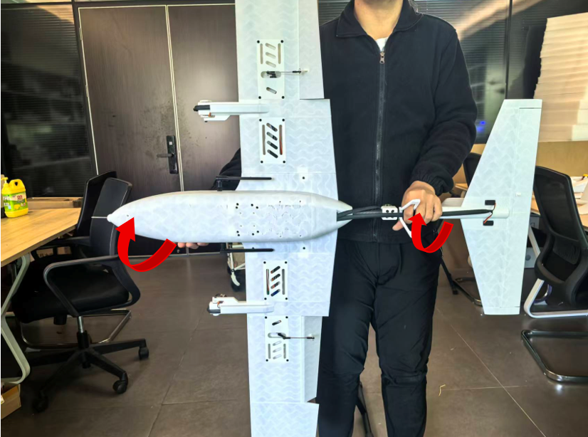

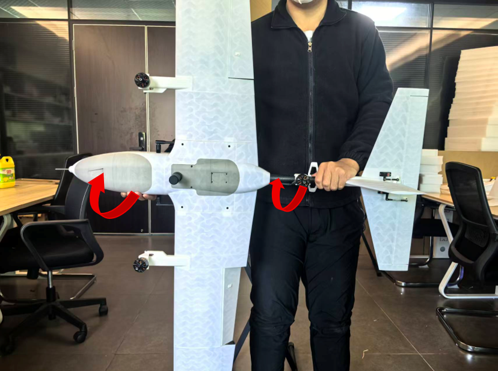

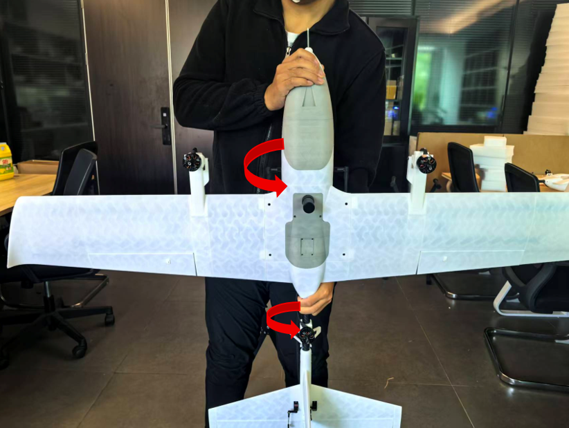

* 磁罗盘校准完成后，会弹出重启无人机的提示，重新上电后，即可完成磁罗盘校准。

### 陀螺仪校准

* 保证无人机静止，水平放置。点击QGC左上角图标菜单 -> Vehicle Setup

1. 点击，传感器
2. 点击，陀螺仪
3. 点击，OK

### 加速度计

* 保证无人机静止，水平放置。点击QGC左上角图标菜单 -> Vehicle Setup

1. 点击，传感器
2. 点击，加速度计
3. 点击，OK

3. 依图所示摆放无人机姿态后静止，待识别飞机姿态，地面站对应姿态图标由黄转绿，表示该姿态校准完成。

* 红框变黄框表示识别到此姿态

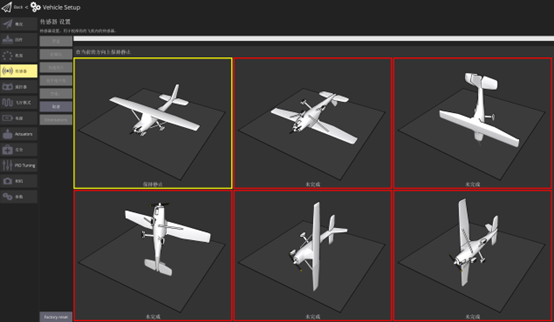

* 待黄框转绿说明该姿态校准完成，可进行剩余未校准的姿态。

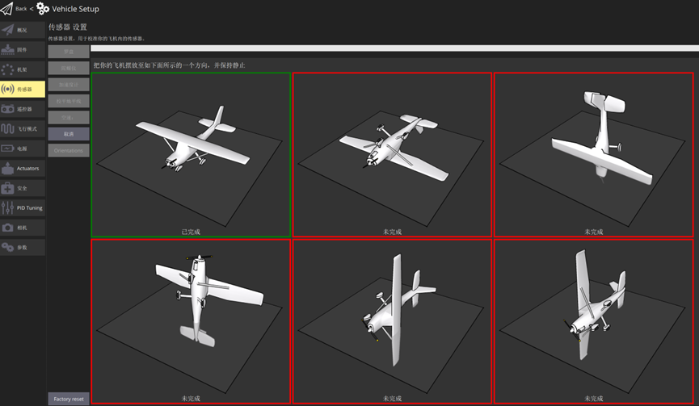

* 依次重复上述操作，直至完成加速度计的校准（校准顺序不做要求）

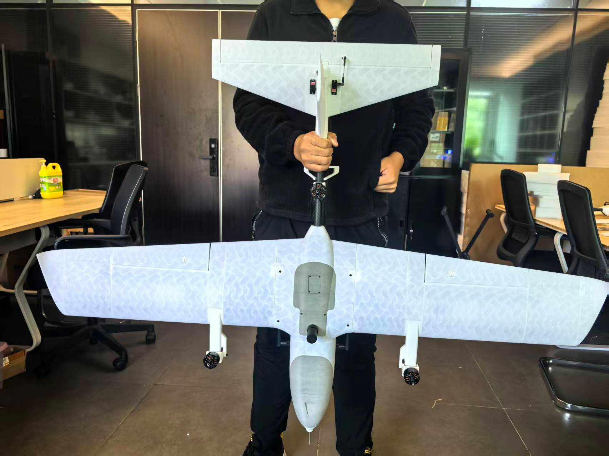

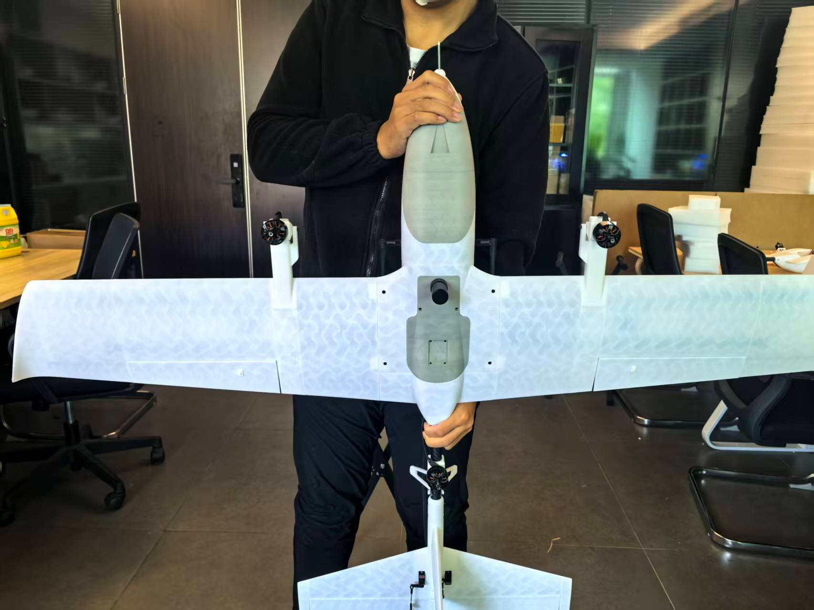

### 校平地平线

* 保证无人机静止，水平放置。点击QGC左上角图标菜单 -> Vehicle Setup

1. 点击，传感器
2. 点击，校平地平线
3. 点击，OK

* 成功校平地平线后如下

### 空速校准

* 保证无人机静止，水平放置。点击QGC左上角图标菜单 -> Vehicle Setup

1. 点击，传感器
2. 点击，空速
3. 点击，OK

* 待出现“Blow in front of pitot without touching”提示，用手挡住空速计，不要让环境风吹到空速

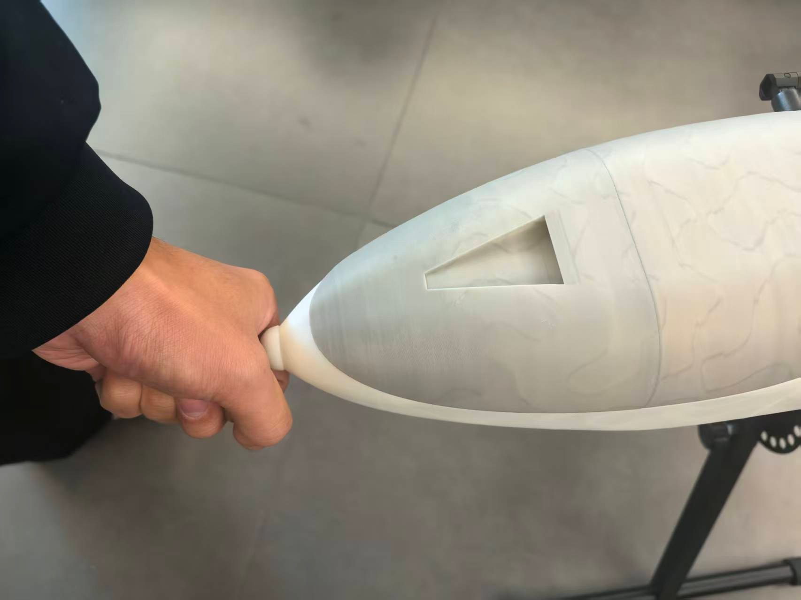

* 提示“create air pressure”信息时，用力朝空速计吹气

* 出现“calibration done”为校准成功

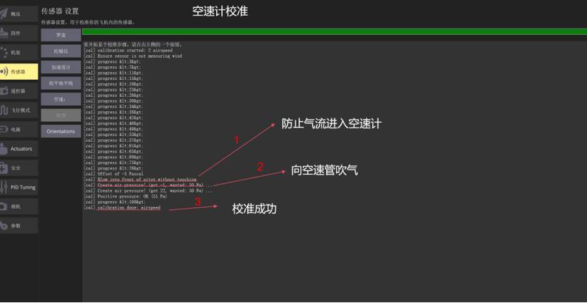

# PX4相关

* [本文相关教程基于px4官方](https://docs.px4.io/main/en/)

## 安全（故障保护）配置

QGroundControl安全设置
在 QGroundControl 中，点击图标，选择 飞行器设置，然后在侧边栏点击 安全，即可进入安全设置页面。该页面包含许多关键的故障保护设置（如电池、遥控信号丢失等），以及触发 “返回” 和 “降落” 动作的相关设置。

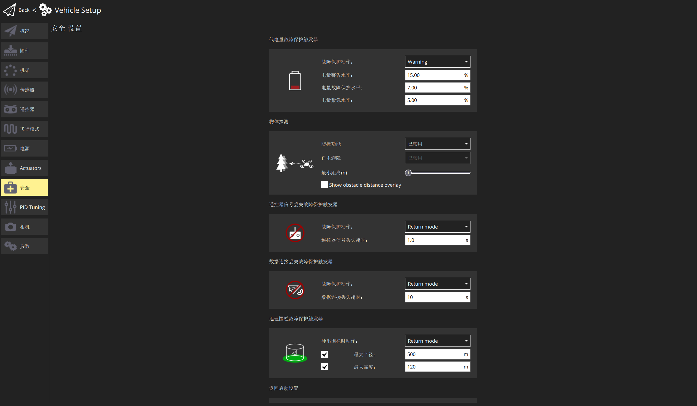

### 故障保护动作

触发故障保护时，（大多数故障保护的）默认行为是在执行相关故障保护动作前，先进入悬停状态并保持 COM_FAIL_ACT_T 秒。这使用户有时间留意正在发生的情况，并在必要时取消故障保护。在多数情况下，可通过使用遥控器（RC）或地面控制站（GCS）切换模式来实现（注意，在故障保护悬停期间，移动遥控器操纵杆不会触发取消操作）。

以下列表按严重程度升序展示了所有故障保护动作。请注意，不同类型的故障保护可能并不支持所有这些操作。

| 动作        | 描述                                                                                                                                                                                              |
| ----------- | ------------------------------------------------------------------------------------------------------------------------------------------------------------------------------------------------- |
| 无操作/禁用 | 不执行任何操作，故障保护将被忽略。                                                                                                                                                                |
| 警告        | 发送一条警告信息（例如发送至 QGroundControl ）。                                                                                                                                                  |
| 悬停模式    | 飞行器将分别进入悬停模式（多旋翼）或悬停模式（固定翼）进行悬停或盘旋。垂直起降（VTOL）飞行器将保持当前模式（多旋翼/固定翼）。                                                                     |
| 返航模式    | 飞行器将进入 "返航模式"。返航行为可在返航设置（如下）中设定。                                                                                                                                     |
| 降落模式    | 飞行器将进入降落模式（多旋翼）或降落模式（固定翼）并降落。垂直起降飞行器将首先转换到多旋翼模式。                                                                                                  |
| 解除武装    | 立即停止电机运转。                                                                                                                                                                                |
| 飞行终止    | 关闭所有控制器，并将所有PWM输出设置为故障保护值（例如 PWM_MAIN_FAILn、PWM_AUX_FAILn）。故障保护输出可用于启动降落伞、起落架或执行其他操作。对于固定翼飞行器，这可能使您能将飞行器滑翔至安全位置。 |

若多个故障保护同时触发，将执行更高级别的操作。例如，若同时失去遥控信号和GPS信号，且手动控制信号丢失设置为返航模式，地面站连接丢失设置为降落模式，则执行降落操作。

### 返航设置

“返航” 是一种常见的故障保护动作，它会启动返航模式，使飞行器返回起飞位置。每架飞行器的默认设置通常是适用的，但对于固定翼飞行器，通常需要定义一个任务降落点。

QGC允许用户设置返航模式和降落行为的某些方面，例如返航高度60m，以及如需展开起落架时的盘旋时间。

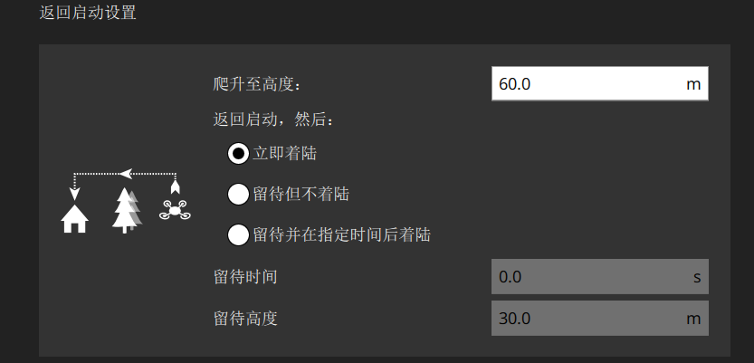

### 降落模式设置

“在当前位置降落” 是一种常见的故障保护动作（特别是对于多旋翼飞行器），它会启动降落模式。每架飞行器的默认设置通常是适用的。

QGC允许用户设置降落行为的某些方面，例如降落解除武装的时间2s以及下降速率0.7m/s（仅适用于多旋翼飞行器）。

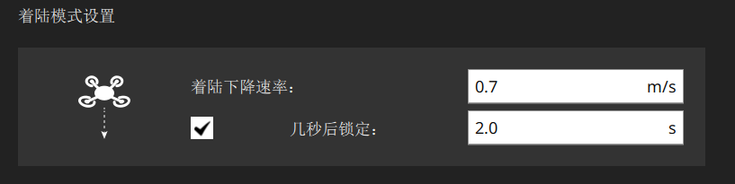

## 电池故障保护

### 电池电量故障保护

当电池电量降至电池故障保护水平值7%以下时，将触发低电量故障保护。您可以在QGroundControl中配置每个级别的电量值和故障保护动作。

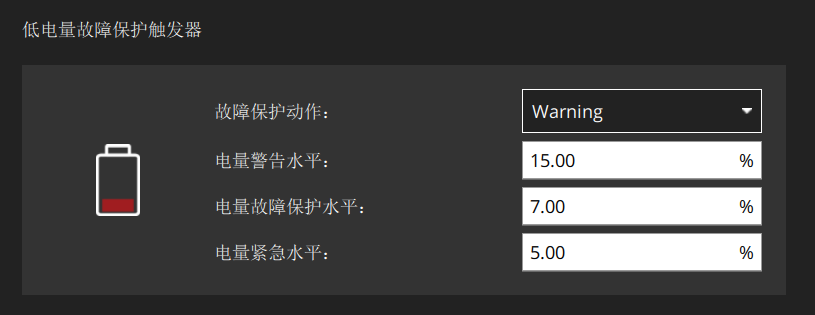

最常见的配置是如上设置值和动作（警告 > 故障保护 > 紧急），并将故障保护动作设置为在 “警告电量” 时发出警告，在 “故障保护电量” 时触发返航模式，在 “紧急电量” 时立即降落。

以下展示了相关设置和底层参数。

| 设置             | 参数            | 描述                                                 |
| ---------------- | --------------- | ---------------------------------------------------- |
| 故障保护动作     | COM_LOW_BAT_ACT | 当电量降至触发水平以下时，执行警告、返航或降落动作。 |
| 电池警告电量     | BAT_LOW_THR     | 需做出警告（或其他动作）的电量百分比。               |
| 电池故障保护电量 | BAT_CRIT_THR    | 电量低于该百分比则返航（或者执行其他事前选择动作）。 |
| 电池紧急电量     | BAT_EMERGEN_THR | 电量低于该百分比则（立即）触发降落动作。             |

### 飞行时间故障保护

还有其他几种 “与电池相关” 的故障保护机制，可通过参数进行配置：

“安全返航剩余飞行时间” 故障保护（COM_FLTT_LOW_ACT），当PX4估计飞行器剩余电量仅够以返航模式降落时触发。您可以将其配置为忽略故障保护、发出警告或启动返航模式。
“最大飞行时间故障保护”（COM_FLT_TIME_MAX）允许您设置起飞后的最大飞行时间，达到该时间后，飞行器将自动进入返航模式（在该时间的90%时也会 “发出警告”）。这类似于对电池总飞行时间的 “硬编码” 估计。该功能默认禁用。
“最低电池电量用于解锁” 参数（COM_ARM_BAT_MIN），若电池电量低于指定值，则一开始就阻止解锁。

| 设置                     | 参数             | 描述                                                                                |
| ------------------------ | ---------------- | ----------------------------------------------------------------------------------- |
| 安全返航低飞行时间动作   | COM_FLTT_LOW_ACT | 当剩余电量仅够以返航模式安全降落时的动作。0：无动作，1：警告，3：返航模式（默认）。 |
| 最大飞行时间故障保护水平 | COM_FLT_TIME_MAX | 达到该时间后将启动返航模式的最大允许飞行时间，单位为秒。-1：禁用（默认）。          |

### 手动控制信号丢失故障保护

如果与遥控器 或 操纵杆 的连接丢失，且无备用连接，则可能触发手动控制信号丢失故障保护。若使用遥控器，当遥控器信号丢失 1s时会触发此故障保护。若使用通过MAVLink数据链路连接的操纵杆，当操纵杆断开连接或数据链路丢失时会触发此故障保护。

QGroundControl安全用户界面允许您设置故障保护动作 和 遥控信号丢失超时时间。想要在特定自动模式（任务、悬停、外置模式）下禁用遥控信号丢失故障保护的用户，可以使用参数 COM_RCL_EXCEPT 进行设置。

| 参数           | 设置                     | 描述                                                                                                                                                                                                                                                            |
| -------------- | ------------------------ | --------------------------------------------------------------------------------------------------------------------------------------------------------------------------------------------------------------------------------------------------------------- |
| COM_RC_LOSS_T  | 手动控制信号丢失超时时间 | 从选定的手动控制源接收到最后一个设定值后，经过该时间若未收到新设定值，则认为手动控制信号丢失。此时间必须设置得较短，因为在超时触发前，飞行器将继续按照旧的手动控制设定值飞行。                                                                                  |
| COM_FAIL_ACT_T | 故障保护反应延迟时间     | 故障保护条件触发（COM_RC_LOSS_T）与故障保护动作（返航、降落、悬停）之间的延迟时间，单位为秒。在此状态下，飞行器在悬停模式下等待手动控制源重新连接。对于远程飞行，此时间可设置得较长，以便间歇性连接丢失不会立即触发故障保护。也可设置为零，使故障保护立即触发。 |
| NAV_RCL_ACT    | 故障保护动作             | 禁用、盘旋、返航、降落、解除武装、终止。                                                                                                                                                                                                                        |
| COM_RCL_EXCEPT | 遥控信号丢失例外情况     | 设置忽略手动控制信号丢失的模式：任务、悬停、外置模式。                                                                                                                                                                                                          |

### 数据链路丢失故障保护

如果遥测链路（与地面站的连接）丢失10s以上，将触发数据链路丢失故障保护。

| 设置             | 参数          | 描述                                                 |
| ---------------- | ------------- | ---------------------------------------------------- |
| 数据链路丢失超时 | COM_DL_LOSS_T | 数据连接断开后到故障保护触发之前的时间。             |
| 故障保护动作     | NAV_DLL_ACT   | 禁用、悬停模式、返航模式、降落模式、解除武装、终止。 |

### 地理围栏故障保护

当无人机突破 “虚拟” 边界时，将触发地理围栏故障保护。最简单的形式是，将边界设置为以起飞位置为中心的圆柱体。如果飞行器移动到半径500m之外或高于120m高度，将触发指定的故障保护动作。

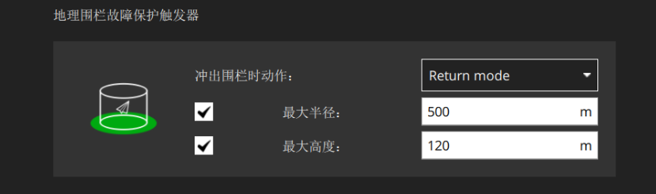

以下展示了相关设置和底层地理围栏参数。

| 设置                 | 参数            | 描述                                                  |
| -------------------- | --------------- | ----------------------------------------------------- |
| 冲出围栏时的响应动作 | GF_ACTION       | 无动作、警告、悬停模式、返航模式、终止、降落。        |
| 最大半径             | GF_MAX_HOR_DIST | 地理围栏圆柱体的水平半径。 如果为 0，则禁用地理围栏。 |
| 最大高度             | GF_MAX_VER_DIST | 地理围栏圆柱体的高度。 如果为 0，则禁用地理围栏。     |

以下设置同样适用，但不会显示在QGC用户界面中。

| 设置               | 参数            | 描述                                                                                       |
| ------------------ | --------------- | ------------------------------------------------------------------------------------------ |
| 地理围栏数据源     | GF_SOURCE       | 设置定位是来自全局位置估计还是直接来自 GPS 设备。                                          |
| 预发性地理围栏触发 | GF_PREDICT      | （实验性）如果预测飞行器当前运动将触发突破围栏，则触发地理围栏（而不是在突破后延迟触发）。 |
| 飞行终止断路器     | CBRK_FLIGHTTERM | 启用/禁用飞行终止操作（默认禁用）。                                                        |

### 位置（GNSS）丢失故障保护

如果PX4全局位置估计的质量在需要可接受位置估计的模式下降至可接受水平以下（这可能是由于GPS信号丢失导致），将触发位置丢失故障保护。

故障动作由 COM_POSCTL_NAVL 控制，具体取决于是否假定遥控可用（以及高度信息）：

0：遥控可用。如果有高度估计，则切换到高度模式，否则切换到稳定模式。
1：遥控不可用。如果有高度估计，则切换到下降模式，否则进入飞行终止。下降模式 是一种不需要位置估计的降落模式。
固定翼飞行器和处于固定翼飞行状态的垂直起降飞行器还有一个参数（FW_GPSF_LT），用于定义在失去位置后尝试降落前，它们将在当前高度盘旋（以恒定滚转角 FW_GPSF_R 盘旋）多长时间。如果垂直起降飞行器配置为切换到悬停状态降落（NAV_FORCE_VT），则它们将首先转换模式，然后下降。

以下展示了所有飞行器的相关参数。

| 参数            | 描述                                                                      |
| --------------- | ------------------------------------------------------------------------- |
| COM_POSCTL_NAVL | 任务期间位置控制导航丢失响应。 值：0——假设使用遥控，1——假设没有遥控。 |
