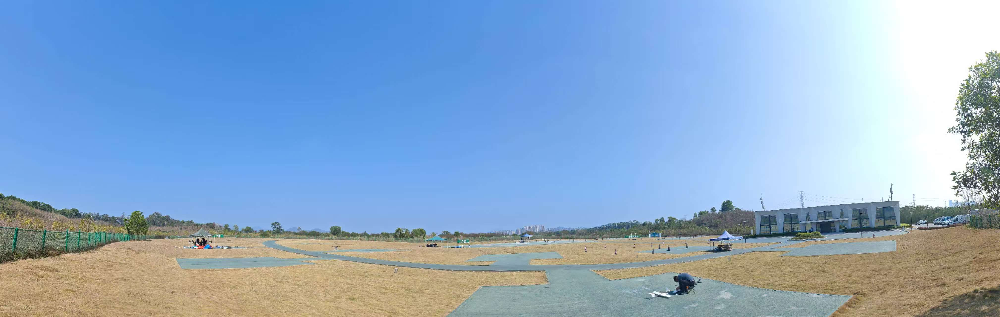

# 飞行场地准备

在进行 SwiftWing S7 VTOL 无人机飞行前，选择合适的场地并做好充分准备是确保飞行安全和任务成功的关键步骤。本指南将详细介绍飞行场地准备的各项要点。

## 场地选择基本要求

### 空间要求

- **起飞/降落区域**：至少需要 10m × 10m 的平坦开阔区域
- **飞行场地**：至少需要 300m × 300m 的平坦开阔区域，避免人群、道路、电力线路等障碍物
- **飞行空域**：周围无高大建筑物、树木或其他障碍物，确保无人机有足够的飞行空间
- **安全距离**：与人群、道路、电力线路等保持至少 50 米的安全距离

### 地面条件

- **地面平整**：选择硬化地面或平整的草地，避免凹凸不平或松软的地面
- **排水良好**：确保场地在雨后不会积水
- **无尖锐物体**：清除起飞/降落区域内的石块、树枝等尖锐物体

## 环境评估

### 气象条件

- **风速**：理想飞行风速应为无风条件，避免在三级风以上飞行
- **能见度**：确保视野清晰，能见度至少 1000 米以上
- **天气状况**：避免在雷雨、雾霾、沙尘暴等恶劣天气条件下飞行
- **温度**：确保电池和设备在适宜的温度范围内工作（通常为 0°C 至 40°C）

### 电磁环境

- **避开强电磁干扰区域**：远离高压线、变电站、雷达站等电磁辐射源
- **GPS 信号**：选择 GPS 信号良好的区域，避免信号遮挡或干扰

## 注意事项

- **遵守法律法规**：严格遵守当地关于无人机飞行的法律法规
- **保持通信畅通**：飞行过程中保持与地面团队的通信畅通
- **应急预案**：提前制定应急情况的处理方案
- **飞行日志**：记录每次飞行的场地条件、气象数据和飞行情况

通过以上步骤的准备工作，可以大大提高 SwiftWing S7 VTOL 无人机飞行的安全性和成功率。在每次飞行前，务必认真执行场地准备和安全检查，确保飞行任务顺利完成。
