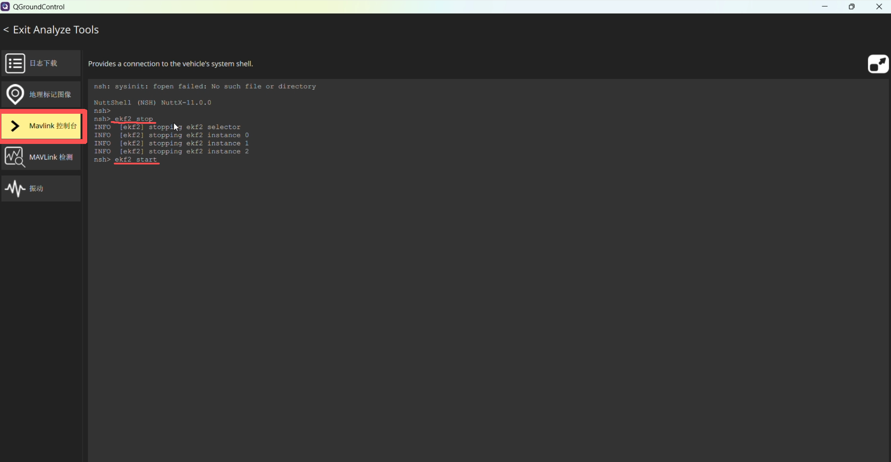
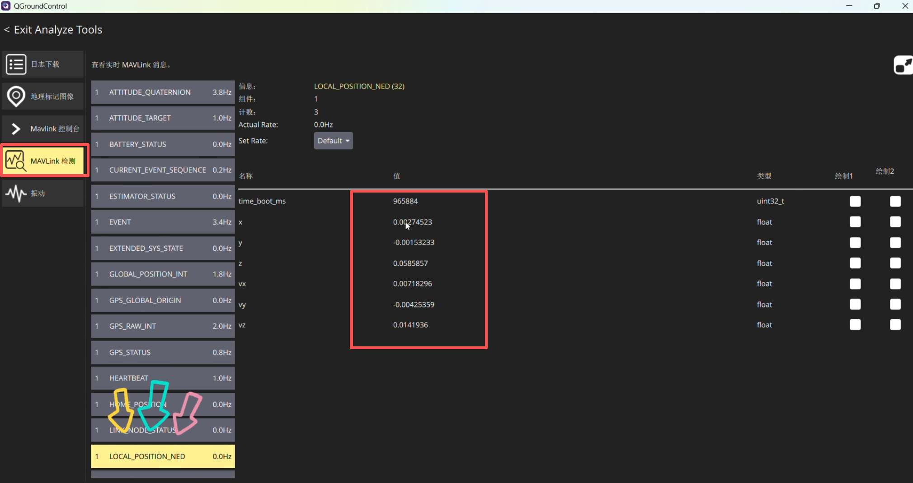
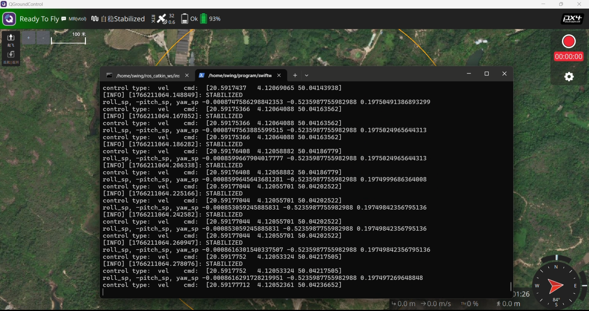
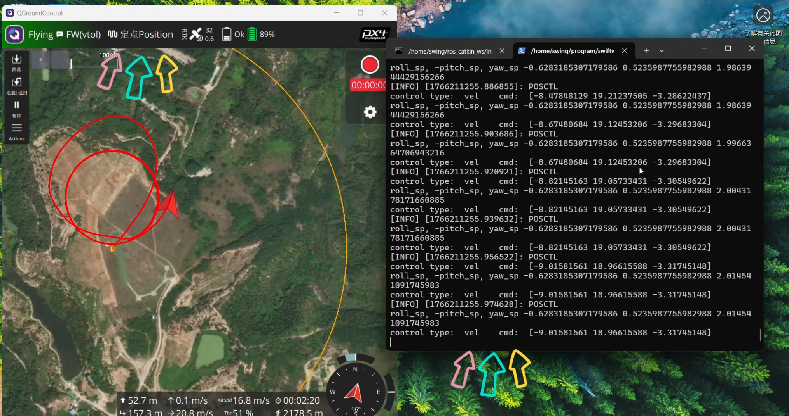
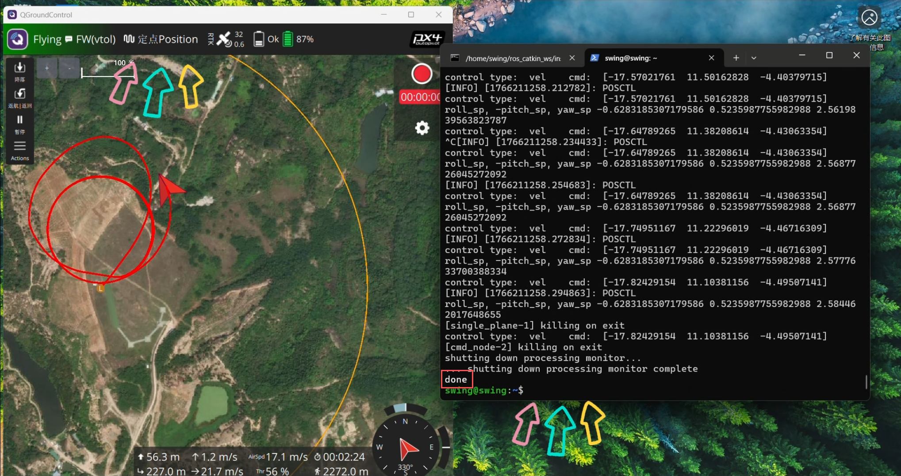
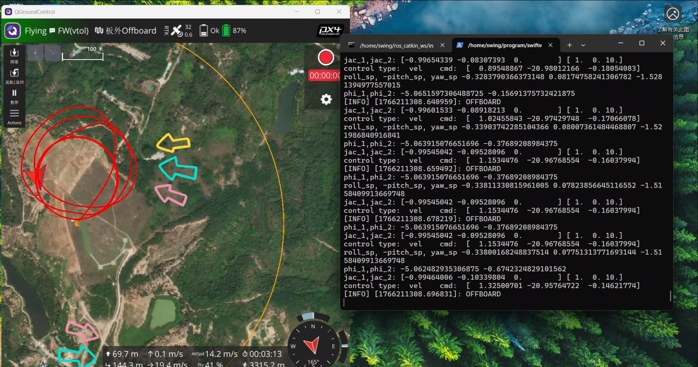
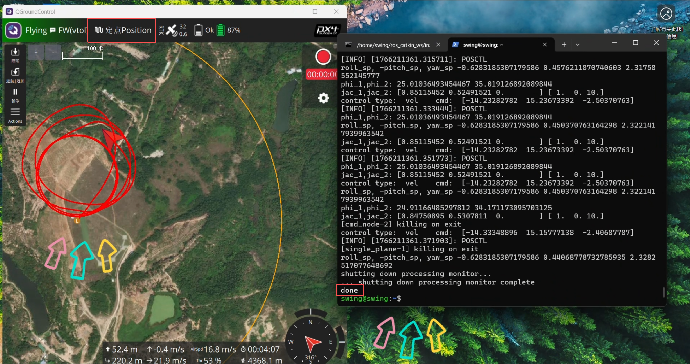
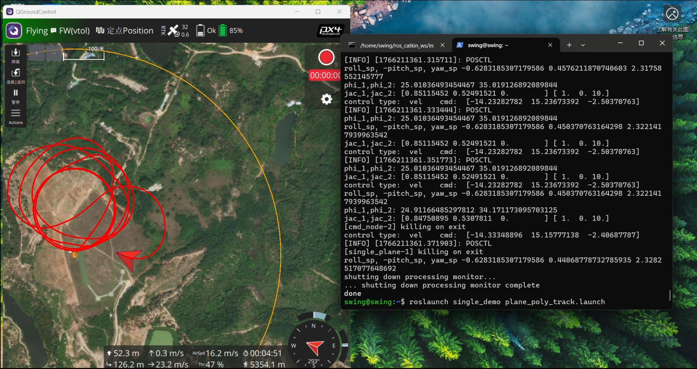
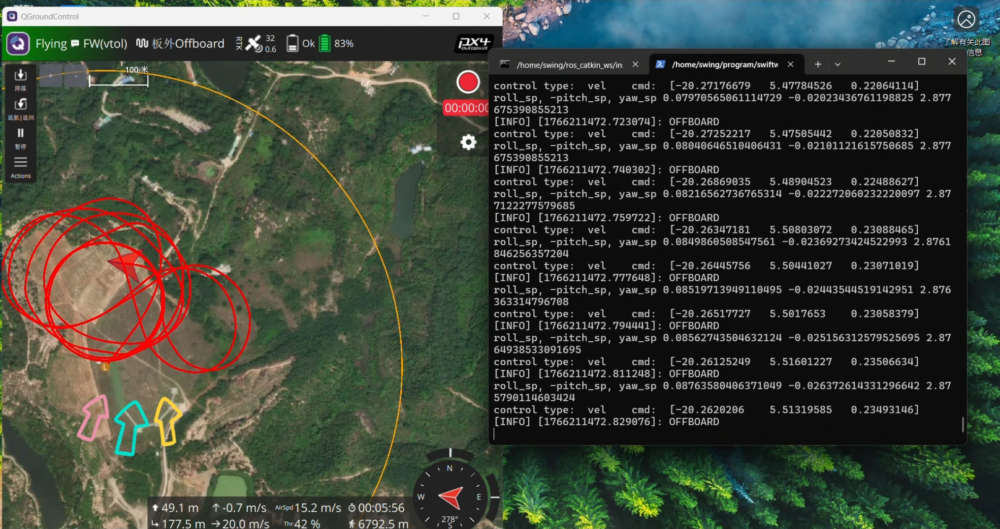

# 完整飞行演示
## 准备阶段
1. 确认电池电量充足
2. 检查确认旋翼和固定翼舵面正常
3. 检查电机转向无误（左前顺时针，右前和尾电机逆时针），注意螺旋桨安装方向上与电机转向同向的螺旋桨，螺母一定要固定死
4. 用纤维胶带将飞机舱盖粘好防止意外脱落

* 如果无人机上电的位置不是起飞点，则需要手动重启融合定位，输入 ekf2 stop，然后再输入 ekf2 start，等待五秒重新融合定位

* 通过这个消息，即可查看定位数据是否刷新，也可返回主页查看状态栏

* 方卫星的这个图标，检查 Accuracy 是否在 2 米以内，在 2 米以内说明定位良好可

* 启动mavros程序，输入 *roslaunch mavros swing.launch*

1. 启动绕圆控制程序，输入：*roslaunch single_demo plane_circle_track.launch*

* 运行后，显示当前飞行模式时说明启动成功,当控制程序显示当前飞行模式时，说明控制程序启动完毕

* 旋翼模式起飞

* 注意待控制程序终端显示 POSCTL 飞行模式字样，即表明机载电脑与飞控已建立通信连接，方可切换无人机至 OFFBOARD 模式；若终端未出现该标识，严禁切换至 OFFBOARD 模式，需等待 POSCTL 字样显示后，再执行模式切换操作。（要强调的是，每次切入 OFFBOARD 模式前都需要确认终端是否读取到当前飞行模式!!!）

* 控制程序正常运行，飞手控制无人机飞到合适的高度和朝向,就可以切入 OFFBOARD 模式，响应控制程序的指令了,切入 OFFBOARD 模式后，无人机响应机载控制指令，就不需要飞手再控制无人机了，这里靠近圆形轨迹逆时针的切线方向，高度在 50米左右，直接切入 OFFBOARD 模式，飞手持续关注无人机飞行状态即可，可以持续观察右边控制指令和左边飞行轨迹

* 注意需要中断当前飞行控制，然后启动其他控制程序时，一定需要飞手先退出 OFFBOARD 模式，然后再启动其他控制程序，否则飞机大概率会出现异常状态，飞手在定点模式下手动控制飞行，然后才能中断正在运行的程序，启动新的控制程序

* 一定要等飞手切出offboard模式后，再终止控制程序，当出现done字样时，说明控制程序已终止

2. 启动下一程序绕飞斜圆，输入：roslaunch single_demo plane_circle_track.launch  这里启动斜圆控制程序，在 ENU 坐标系下，40 米到 60 米高度之间，圆心 x 为 0，y 为 100，半径为 100 米，从右下到左上逆时针飞行的斜圆，当控制程序显示当前飞行模式时，说明控制程序正常运行，飞手调整无人机位置和朝向到斜圆的切线位置和方向，最好是在从高处往低处飞行的切线位置和方向切换到 OFFBOARD 模式  

* 待控制程序终端显示 POSCTL 飞行模式字样，即表明机载电脑与飞控已建立通信连接，方可切换无人机至 OFFBOARD 模式；若终端未出现该标识，严禁切换至 OFFBOARD 模式，需等待 POSCTL 字样显示后，再执行模式切换操作。（要强调的是，每次切入 OFFBOARD 模式前都需要确认终端是否读取到当前飞行模式!!!）

* 无人机在机载控制下绕圆的同时，高度在周期性变化

* 注意需要中断当前飞行控制，然后启动其他控制程序时，一定需要飞手先退出 OFFBOARD 模式，然后再启动其他控制程序，否则飞机大概率会出现异常状态，飞手在定点模式下手动控制飞行，然后才能中断正在运行的程序，启动新的控制程序

* 一定要等飞手切出offboard模式后，再终止控制程序，当出现done字样时，说明控制程序已终止

3. 启动下一程序绕飞八字，输入：roslaunch single_demo plane_poly_track.launch  这里启动新的绕八控制程序，飞手同时调整无人机到八字的切线位置和方向,绕八控制程序的飞行高度为 50 米,中心在 ENU 坐标系下的 x 为 0，y 为 100，x 和 y 最大为 200 的轨迹

* 待控制程序终端显示 POSCTL 飞行模式字样，即表明机载电脑与飞控已建立通信连接，方可切换无人机至 OFFBOARD 模式；若终端未出现该标识，严禁切换至 OFFBOARD 模式，需等待 POSCTL 字样显示后，再执行模式切换操作。（要强调的是，每次切入 OFFBOARD 模式前都需要确认终端是否读取到当前飞行模式!!!）

* 调整无人机位置和朝向，从右后方往左前方逆时针飞行，靠近和朝向中心位置

* 这里就直接切入 OFFBOARD 模式，无人机按照控制程序飞行

* 无人机按照程序正常飞行，完成程序控制飞行后，即可手动接管,飞手手动控制在固定翼模式下降低高度和速度,在朝向逆风的方向，切换到旋翼模式降落即可,完成飞行任务并降落上锁后，即可断开程序和无人机电源

