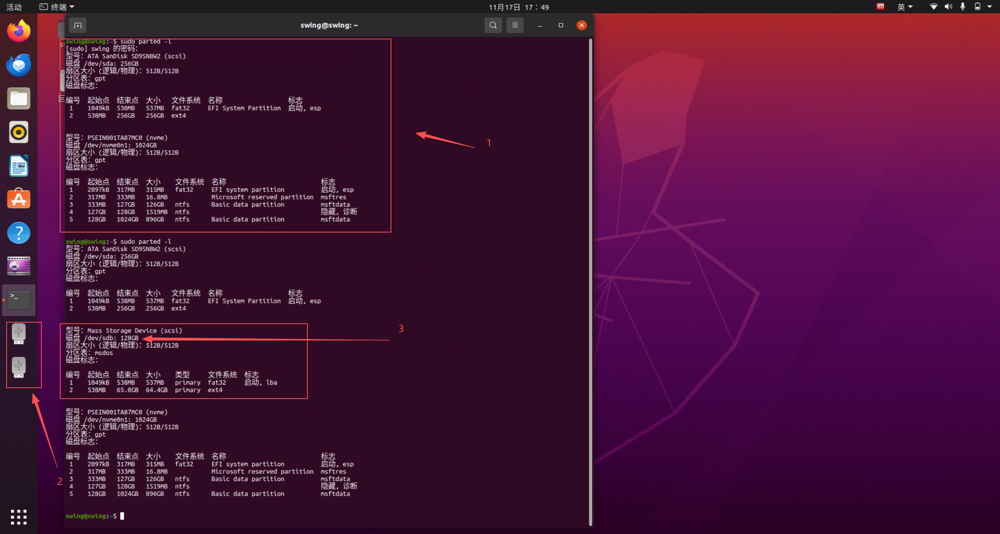
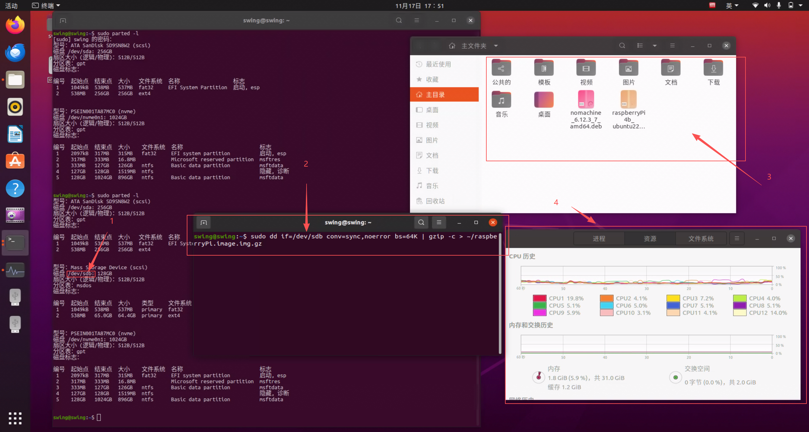
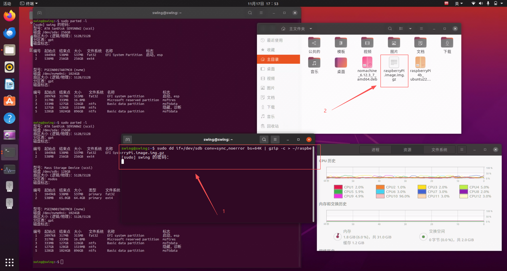
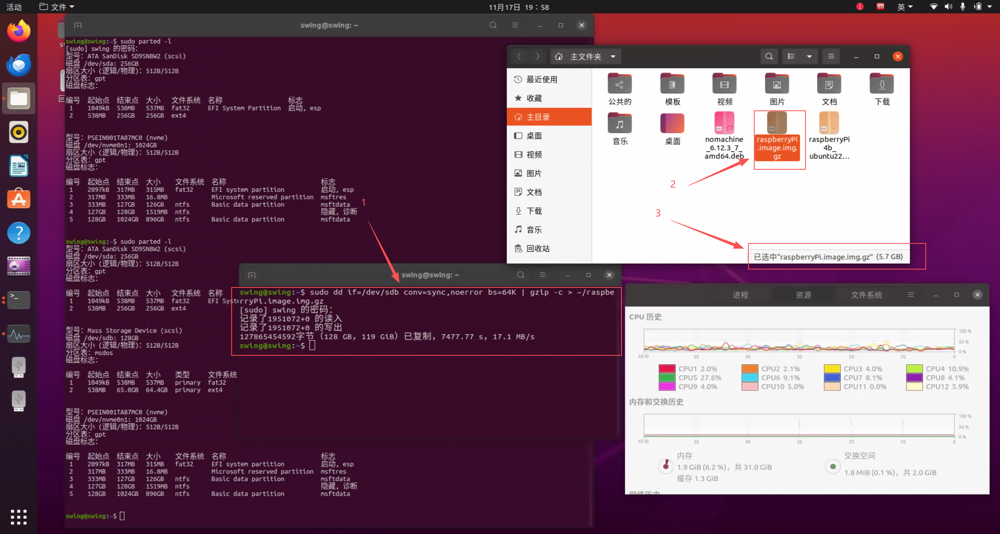
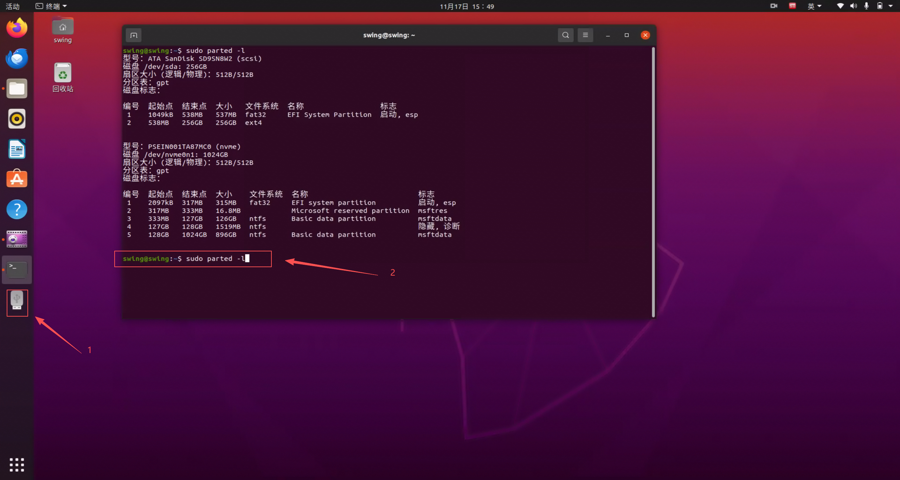
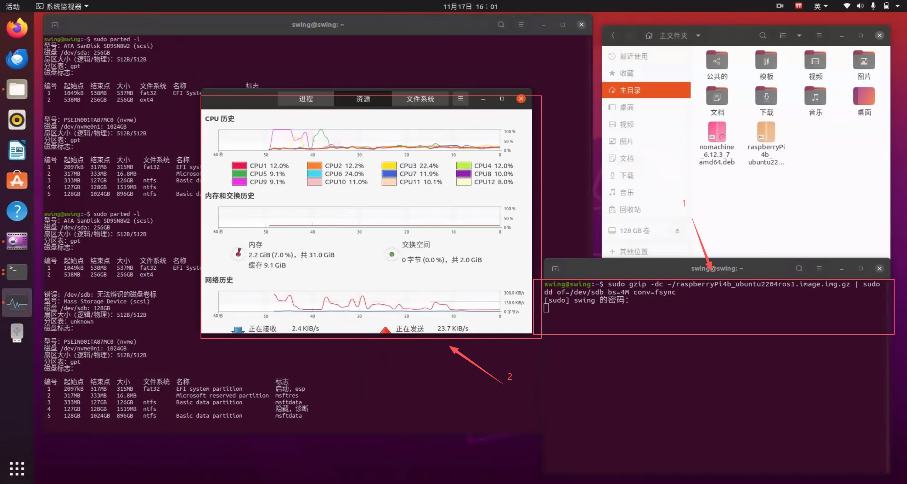
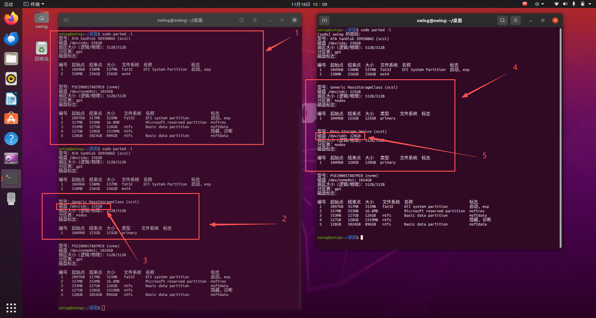
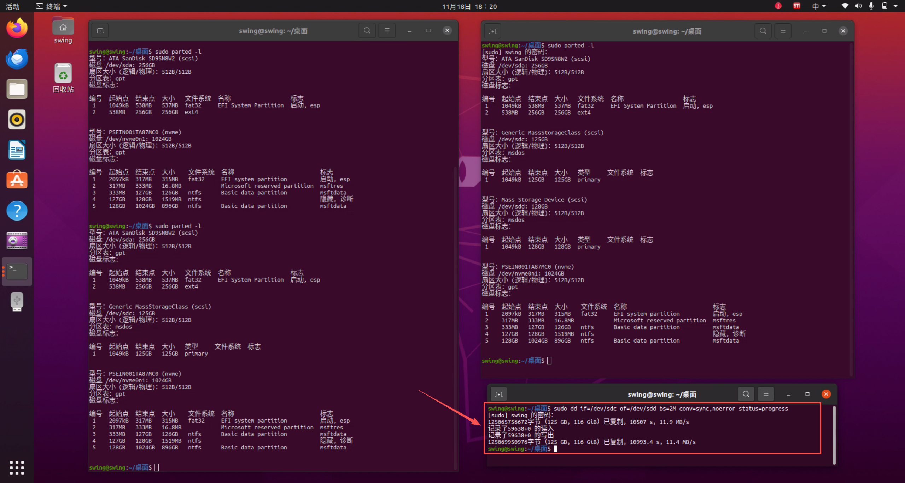

# 镜像备份

  <strong>说明：</strong> 
  1. Ubuntu下备份恢复教程一制作的镜像需要烧录到更大的SD卡之中（例如：使用32G的SD卡按照教程一制作的镜像可以烧录到64G或者128G的SD卡） 
  2. Ubuntu下备份恢复教程二，可以同时完成镜像的备份和恢复，是一种以超级用户权限将第一个硬盘（/dev/sda）的数据完整地复制到第二个硬盘（/dev/sdb） 
  3. 数据丢失风险：使用dd命令时要非常小心，因为错误的参数可能会导致数据丢失。例如，将数据写入错误的设备（如/dev/sda而不是/dev/sdb）可能会清除整个硬盘的数据。 
  4. 备份建议：在执行此类操作之前，确保重要数据已备份。

* 推荐使用教程二

## Ubuntu下备份恢复教程一

* 推荐在Ubuntu系统下进行镜像备份操作
* 需要准备如下：
  1. 需要备份的镜像SD卡
  2. SD卡读卡器
  3. 装有Ubuntu系统的电脑（推荐版本为大于等于18.04）且电脑剩余硬盘空间大于20G

### 操作如下

1. 在Ubuntu系统下打开终端输入指令 ``sudo parted -l``，回车

2. 然后将SD卡插入读卡器，再将读卡器插上电脑
3. 再次使用指令 ``sudo parted -l``  ，回车，查看该SD卡系统的存储情况，一般为在上一步基础上新增的部分

4. 根据SD卡的实际容量，找到对应的挂载，如挂载为 ``/dev/sdb``

5. 确认保存路径和镜像名字

6. 输入指令开始制作镜像
   * 其中，/dev/sdb，是SD卡挂载位置
   * ~/，是镜像保存路径
   * raspberryPi，是镜像名字
   * sudo dd if=/dev/sdb conv=sync,noerror status=progress bs=64K | gzip -c > ~/raspberryPi.image.img.gz

7. 等待指令运行，当上面的指令在终端运行结束，则说明镜像制作完成，即可保存对应路径的镜像文件

## Ubuntu下恢复教程

* 需要提前格式化SD卡
* 需要准备一张比做镜像的那张SD卡容量，一样或者更大的SD卡

### 操作如下

1. 在Ubuntu系统下打开终端输入指令 ``sudo parted -l``，回车

2. 然后将SD卡插入读卡器，再将读卡器插上电脑
3. 再次使用指令 ``sudo parted -l``  ，回车，查看该SD卡系统的存储情况，一般为在上一步基础上新增的部分

4. 根据SD卡的实际容量，找到对应的挂载，如挂载为 ``/dev/sdb``

5. 确认镜像文件路径和镜像名字

6. 输入指令开始恢复镜像到SD卡中
   * 其中，/dev/sdb，是SD卡挂载位置
   * ~/，是镜像保存路径
   * raspberryPi4b_ubuntu2204ros1，是镜像名字
   * sudo gzip -dc ~/raspberryPi4b_ubuntu2204ros1.image.img.gz | sudo dd of=/dev/sdb bs=4M conv=fsync status=progress

7. 等待指令运行，当上面的指令在终端运行结束，则说明镜像恢复完成，即可弹出SD卡设备

## Ubuntu下备份恢复教程二

1. 以超级用户权限将第一个硬盘（/dev/sda）的数据完整地复制到第二个硬盘（/dev/sdb）。
2. 使用2MB的块大小进行复制。
3. 在复制过程中，如果遇到读取错误，继续复制并对齐块大小。
4. 可以显示复制进度信息。
   * sudo dd if=/dev/sda of=/dev/sdb bs=2M conv=sync,noerror status=progress

### 命令解释

1. sudo:
   * 这个前缀表示以超级用户（root）权限运行命令。因为dd命令通常涉及对设备文件的直接读写，需要管理员权限。
2. dd:
   * 这是实际的命令，表示“data duplicator”（数据复制器），用于在文件之间进行低级别的复制和转换。
3. if=/dev/sda:
   * if表示输入文件（input file）。在这里，/dev/sda代表第一个物理硬盘（通常是系统的主硬盘）。这个参数指明数据将从这个设备读取。
4. of=/dev/sdb:
   * of表示输出文件（output file）。/dev/sdb通常代表第二个物理硬盘。这个参数指明数据将被写入到这个设备。
5. bs=2M:
   * bs表示块大小（block size），这里设置为2M（2 Megabytes）。这意味着在复制的过程中，dd将以2MB为单位进行读写操作。较大的块大小通常会提高复制速度。
6. conv=sync,noerror:
   * conv表示转换选项。
   * sync: 在输入和输出块之间进行同步，如果输入块的大小不足2MB，dd会填充零，使输出块大小一致。
   * noerror: 遇到错误时继续操作，尽可能完成复制，而不是中断。这在复制损坏的设备时非常有用。
   * status=progress:这个选项用于显示进度信息。在复制过程中，会定期显示已复制的数据量，使用户能够看到操作的进度。

### 操作如下

1. 在Ubuntu系统下打开终端输入指令 ``sudo parted -l``，回车
2. 然后将SD卡插入读卡器，再将读卡器插上电脑
3. 再次使用指令 ``sudo parted -l``  ，回车，查看该SD卡系统的存储情况，一般为在上一步基础上新增的部分
4. 根据SD卡的实际容量，找到对应的挂载，如挂载为 ``/dev/sdc``  ``/dev/sdd``

1. 此处需要备份或者恢复的镜像源文件在第一个接入的SD卡，即：``/dev/sdc``
2. 此处用作备份保存或者恢复镜像的SD卡在第二个接入
3. 确认了源镜像SD卡和保存的SD卡后，将设备的 ``/dev/sdc``和 ``/dev/sdd``填入对应位置

* 开始备份镜像或者恢复镜像
* sudo dd if=/dev/sdc of=/dev/sdd bs=2M conv=sync,noerror status=progress

* 等待备份完成后，即可弹出SD卡设备

